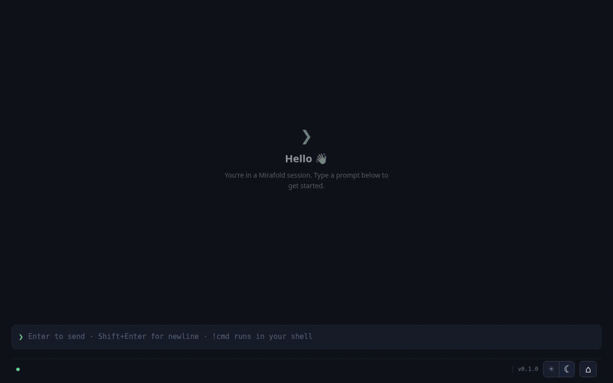

# genui-shell

A **generative-UI shell over the Claude Agent SDK**. Claude Code's full agentic
engine — filesystem, bash, tools, a warm persistent session — runs behind a web
front end, and the agent's output stream is treated as a **UI-instruction
stream**: it paints streamed markdown and live registry components into an
output zone, those components can act back through a server-mediated action
bridge, and Phase 3 (in progress) adds sandboxed arbitrary UI — the
locked-down iframe host is already in place. A fixed, trusted shell owns the
prompt box, the socket, and all credentials, and the agent can never touch
any of them.

Think of it as a terminal successor, not a chat app: monospace command strips
in, rich rendered output back. The vision is a **strict superset of the
terminal** — same engine, and never *less* visibility than the terminal gives
(thinking, tool detail, diffs, subagent progress); richness is added on top
of raw visibility, never traded against it (PLAN Phase T2 tracks the
remaining gaps).



*Two prompts, live and unscripted: ask about a repo → the agent answers with
an overview card, a dependency table, and doc links — clicking one opens the
real page. Then paste latency numbers → it chooses a line chart (hover it:
a real component, not a picture) → **pin** it → one more ask, and the agent
updates the **pinned** chart in place.*

This document is the technical orientation for someone taking ownership of the
codebase. Companion documents:

- **[PLAN.md](PLAN.md)** — the phased build plan. Every step has
  Goal / Build / Files / Done-when. Shipped so far: **Phases 0, 1, T, and 2**,
  plus the Phase 4 session registry (4.1/4.2); **Phase 3 is in progress**
  (the sandboxed host, 3.1, is done). PLAN.md is the source of truth for what
  comes next and why.
- **[BUSINESS.md](BUSINESS.md)** — positioning, wedges, pricing, and the
  milestone gates that sequence the plan. The two build-relevant conclusions:
  ship the Phase 1 demo before Phase T, and keep every seam local-first.

---

## 1. The one-paragraph mental model

The server holds **warm agent sessions** (each one long-lived `query()` from
`@anthropic-ai/claude-agent-sdk`, fed prompts through an async generator so
the conversation and prompt cache never reset between turns) in a registry;
a WebSocket connection is a *viewport* that attaches to one. The session's
SDK event stream is **normalized into a tiny wire protocol** (`WireMsg`),
buffered for replay, and fanned out to every attached viewport. The browser is split into two zones
with a hard security boundary: a **trusted shell** (prompt box + socket
client, never re-rendered by agent output) and an **output zone** that is
purely an *interpreter* of `WireMsg` — it renders whatever messages arrive
and has no other inputs. Growing the product = adding message types to the
wire protocol and handlers to the interpreter. Nothing else changes shape.

## 2. The two load-bearing contracts

Everything in the repo hangs off two interfaces. Internalize these and you
can navigate the whole codebase.

### 2.1 The wire protocol (`server/protocol.ts`)

The contract between server and browser. Currently on the wire:

```ts
// Server → browser
type WireMsg =
  | { type: "text_delta"; text: string }                           // streamed markdown
  | { type: "status"; state: "thinking" | "tool"; label?: string } // activity line
  | { type: "turn_end" }                                           // finalize the turn
  | { type: "error"; message: string }
  | { type: "render"; component: string; props: Record<string, unknown>; id: string }
    // ^ Phase 1: "mount registry component X with props P". Re-sending an id
    //   updates that component in place (the live-pinned-widget mechanism).
    //   `component` is a plain string so unknown instructions stay
    //   representable and can degrade gracefully (Step 1.4).
  | { type: "tool_use"; name: string; detail?: string; id: string }        // T.1: a tool
  | { type: "tool_result"; output: string; isError?: boolean; id: string } //   call record
  | { type: "permission_request"; tool: string; detail: string; id: string } // T.3
  | { type: "user_prompt"; text: string }              // 4.2: server-echoed user turn
  | { type: "session_created"; sessionId: string; cwd: string }; // 4.2: attach reply

// Browser → server
type ClientMsg =
  | { type: "prompt"; text: string }
  | { type: "interrupt" }                                       // T.2: halt the turn
  | { type: "permission_response"; id: string; allow: boolean } // T.3
  | { type: "attach"; sessionId: string }   // 4.2: join a registry session…
  | { type: "create"; cwd?: string }        //   …or start a fresh one
  | { type: "action"; action: Action; sourceId: string }; // Phase 2: component action
```

`Action` (also in `protocol.ts`) is the complete vocabulary of what a
component interaction may do — `prompt` (round-trips as a user turn), `tool`
(runs a server-side allowlisted tool, §5.4), or `state` (pin/unpin;
output-zone-local, never sent).

**The cardinal rule: later phases ADD message types; existing shapes never
change.** That's what makes every phase additive and keeps old clients from
breaking. The remaining planned additions are `artifact` (Phase 3) and the
session-list messages for the fleet view (Step 4.6).

Both sides import the *same file*: the web build resolves `@protocol` to
`server/protocol.ts` via a Vite alias + tsconfig path. There is one source of
truth for message shapes, enforced by the type checker on both ends.

### 2.2 `AgentSession` (`server/session.ts`)

```ts
interface AgentSession {
  pushPrompt(text: string): void;              // feed a user turn in
  onMessage(cb: (msg: WireMsg) => void): void; // subscribe to normalized output
  interrupt(): void;                           // T.2: halt the turn; stay warm
  resolvePermission(id: string, allow: boolean): void; // T.3: browser's answer
  close(): void;
}
```

Two implementations exist behind this interface, and the server (and
everything downstream, including the entire front end) cannot tell them
apart:

- **`Session`** — the real thing, wrapping the Agent SDK.
- **`MockSession`** — a scripted stand-in used automatically when
  `ANTHROPIC_API_KEY` is unset. Emits every wire message type with
  realistic pacing, drawing replies from a shuffled deck of five demo
  templates (welcome, analytics report, code review, migration plan,
  research brief), and ends every turn with a schema-valid `render` so the
  Phase 1 component pipeline is exercised API-free.

This is a deliberate development strategy, not a testing afterthought:
**every UI capability is built and verified against the mock first**; live
verification with a real key comes last. You can develop the whole front end
without spending a token.

## 3. The security model (do not violate)

Two zones in the browser, hard boundary between them:

```
┌─ OUTPUT ZONE — agent-controlled, sandboxed ──────────┐
│   Level 1: styled markdown            (shipped)      │
│   Level 2: registry components        (shipped)      │
│   Level 3: sandboxed-iframe artifacts (shipped)      │
├─ SHELL — TRUSTED, never re-rendered by the agent ────┤
│   prompt box · WebSocket client · all credentials    │
└──────────────────────────────────────────────────────┘
```

The invariants, and where each is enforced today:

- **The API key never reaches the browser.** It lives only in the server
  process (`server/index.ts` reads env; nothing ever serializes it into a
  `WireMsg`).
- **The agent only emits content into the output zone.** `RenderZone` is the
  sole consumer of agent output, and it only ever renders — it holds no
  socket, no credentials, no callbacks into the shell beyond subscription.
- **No raw agent HTML outside the sandboxed iframe.** `react-markdown` never
  emits raw HTML from its source by default, so streamed markdown can't
  smuggle script or markup (same rule in the registry's `Md` component).
  Links are forced to `target="_blank" rel="noopener noreferrer"`. The one
  place agent HTML executes is `Artifact.tsx`'s opaque-origin iframe.
- **Tool use is gated server-side** (`server/permissions.ts`, see §5.3);
  anything outside the auto-allowed set pauses the turn on a shell-drawn
  permission bar in the browser, deny by default (T.3).
- **Component actions are mediated server-side** (`server/actions.ts`, see
  §5.4): the client never makes an arbitrary call; `tool` actions run against
  an explicit allowlist with validated args, and every action is logged.
- **WebSocket hijacking guard**: browser connections must present a loopback
  `Origin`; a malicious web page can't drive your local agent through a
  cross-site socket. Non-browser clients (wscat, tests) send no Origin and
  pass — they aren't weaponizable the way a browser socket is.

Agent-authored executable UI (Phase 3, shipped) runs only inside
`web/src/Artifact.tsx`'s sandboxed iframe: `allow-scripts` without
`allow-same-origin` gives the content an opaque origin (cookies, storage, and
the parent DOM are structurally unreachable), and an injected
`default-src 'none'` CSP cuts every network path — verified against a hostile
artifact with every escape probe blocked; the threat model is documented
inline in the file. Artifacts talk back through exactly one channel: a
nonce-stamped postMessage bridge (`genui.prompt` / `genui.tool`) validated at
every hop (source window, opaque origin, per-mount nonce, strict shape,
rate limit) and forwarded through the same server-side allowlist mediation
components use. Broken artifacts degrade to their source as styled code, and
a self-navigating artifact is detected by liveness and blanked. The trusted
shell is why this product can safely let an agent paint UI at all — treat the
boundary as inviolable, and treat "the shell draws it, the agent can't fake
it" as the extension of the same rule: the pin affordance (a frame *around*
rendered blocks, unreachable from agent props), the T.3 permission bar, and
the artifact's "sandboxed" chrome are all drawn this way.

## 4. Repository layout

```
server/            the local daemon (Node, run with tsx)
  protocol.ts        WireMsg/ClientMsg/Action — the shared wire contract
  registry-spec.ts   zod shapes per component — spec = tool schema = validation
  render-tools.ts    render_* tools (in-process MCP server) + RENDER_GUIDANCE
  session.ts         Session (real SDK) + MockSession behind AgentSession
  registry.ts        SessionRegistry: sessions decoupled from connections (4.2)
  actions.ts         Phase 2 mediation: allowlisted tools component actions may run
  permissions.ts     canUseTool policy: workspace gating + browser prompts (T.3)
  index.ts           Express + ws server; connections attach as viewports
web/               the browser app (React 19 + Vite)
  index.html         entry html
  src/main.tsx       mounts <Shell/>, imports global CSS + highlight theme
  src/Shell.tsx      TRUSTED SHELL: socket + prompt box + permission bar; bus
  src/PromptBox.tsx  the command bar (auto-grows to 8 lines; Enter sends)
  src/RenderZone.tsx OUTPUT ZONE: WireMsg interpreter → entries + status line
  src/ToolBlock.tsx  collapsed one-line tool-call records in the transcript (T.1)
  src/PinDock.tsx    right-side dock for pinned components (live via entries)
  src/Artifact.tsx   Level 3 host: sandboxed iframe for agent-authored UI (3.1)
  src/registry/      Card, List, Table, LinkGroup, Chart, Md + RenderBlock
                     (validate → fallback → error boundary) + ActionRow/context
  src/ws.ts          SocketClient: typed send/onMessage, reconnect + hello
  src/styles.css     the design identity in CSS (see §7)
demo/              the M1 demo GIF embedded at the top of this README
dist/              built front end (vite build output; served by Express)
workspace/         the agent's cwd — gitignored; all mutation is confined here
PLAN.md            the phased build plan (source of truth for next steps)
BUSINESS.md        strategy; gates that sequence the plan
vite.config.ts     web root, @protocol alias, /ws proxy → :3000, dist output
tsconfig.json      one tsconfig for both sides; @protocol path
.env.example       ANTHROPIC_API_KEY / DEFAULT_MODEL / PORT
```

There is intentionally **no** shared `common/` package, monorepo tooling, or
build step for the server — the repo is one yarn package, the server runs
TypeScript directly via `tsx`, and the single shared file (`protocol.ts`)
crosses the boundary via a path alias.

## 5. The server, top to bottom

### 5.1 `index.ts` + `registry.ts` — transport and the session registry

Express serves `dist/` (the built front end; in dev you use Vite's server
instead) plus `/s/<id>` as a client-side route, and hosts a `ws`
WebSocketServer at `/ws` with the loopback-Origin guard.

**Sessions are decoupled from connections** (Step 4.2). A connection is a
*viewport* onto a session in the `SessionRegistry`: its first message is a
hello — `attach` (session id taken from the `/s/<id>` URL) or `create` — and
the server replies `session_created`, replays the session's buffered history,
then subscribes the socket to the live stream. Every emitted `WireMsg` is
fanned out to all attached viewports and kept in a ring buffer (4000
messages) for replay, so a refresh or a second tab repaints the same
transcript. Closing a tab merely detaches; a session with no viewports dies
only after an idle timeout (default 60 min, `SESSION_IDLE_TIMEOUT_MS`). Each
session gets its own working dir (`workspace/<id>`) — mental model:
session ≈ project. A stale/unknown attach id falls back to a fresh session
rather than an error page.

Inbound messages route accordingly: `prompt` is echoed onto the session
stream as `user_prompt` (all viewports render the command strip identically —
there is no local echo) and pushed into the session; `interrupt` and
`permission_response` forward to the session; `action` hits the Phase 2
mediation path (§5.4).

### 5.2 `session.ts` — the warm session

`Session` is the heart of the server. Key mechanics:

- **One `query()` for the life of the object.** The SDK call's `prompt` is
  an async generator (`promptStream`) backed by a tiny unbounded
  `AsyncQueue`. `pushPrompt(text)` pushes into the queue; the generator
  yields it to the SDK as a user message. Because the query never ends
  between turns, the conversation stays **warm and prompt-cached** — this is
  the "warm session loop" and it's why multi-turn feels instant and cheap.
- **`pump()` normalizes SDK events into `WireMsg`:**
  - `stream_event` → `content_block_delta` (text) becomes `text_delta`
    (enabled by `includePartialMessages: true`, which is what gives
    token-level streaming rather than whole-message chunks);
    `content_block_start` for a thinking block becomes
    `status:{state:"thinking"}`, for a tool_use block becomes
    `status:{state:"tool", label:<tool name>}`.
  - Events carrying a `parent_tool_use_id` are **subagent traffic** and are
    skipped — a subagent's inner monologue must not paint into the user's
    transcript.
  - Full `tool_use` blocks become `tool_use` wire records (Phase T.1) with
    the call's one human-salient argument as `detail` (e.g. the bash
    command); a later `tool_result` with the same id completes the record —
    results are only forwarded for ids the session announced.
  - `result` → `error` (if `is_error`) then always `turn_end`.
- **`interrupt()`** (Phase T.2) halts the in-flight turn via the SDK; the
  session stays warm for the next prompt.
- **Permission prompts** (Phase T.3): when `permissions.ts` needs the user,
  the session emits `permission_request` and blocks that tool call until
  `resolvePermission(id, allow)` arrives from the browser — or denies on
  timeout (default 60 s, `PERMISSION_TIMEOUT_MS`). Deny is the default
  posture on timeout, disconnect, and interrupt.
- **`close()`** pushes a sentinel that ends the generator and calls
  `interrupt()` on the SDK query.
- Session options: `cwd` is the session's own workspace dir handed in by the
  registry (created on construction — spawning into a missing cwd fails with
  a misleading SDK error), model comes from `DEFAULT_MODEL` (default
  `claude-sonnet-4-6`, switchable to `claude-opus-4-8` per the locked
  decisions), and `canUseTool` comes from `permissions.ts`. `settingSources`
  is empty **on purpose**: the daemon must not inherit the host machine's
  CLAUDE.md or memory instructions (a session once wrote into the host's
  real memory dir via "remember X" — isolation is verified by assertion).
- **Generative UI (Phase 1):** the session mounts an in-process MCP server
  (`server/render-tools.ts`) exposing side-effect-free `render_card` /
  `render_list` / `render_table` / `render_chart` / `render_links` tools
  whose input schemas are the registry spec (`server/registry-spec.ts`) plus
  an optional `id` for update-in-place. Calling one emits a `render` WireMsg
  at that point in the stream and returns the id to the model.
  `RENDER_GUIDANCE` (appended to the `claude_code` system-prompt preset)
  teaches when to prefer a component over prose — and that raw HTML/SVG
  renders as literal code, so the agent never improvises markup (arbitrary
  visuals are Phase 3's sandboxed artifacts). The tool schemas' `.describe()`
  strings are written for the model. The agent reaches for components
  unprompted — verified live.

`MockSession` implements the same interface with `setTimeout`-scheduled
emissions: a `thinking` status, fake `tool_use`/`tool_result` records, an
occasional `permission_request` (so the prompt bar is exercisable API-free),
the reply streamed in 16-char chunks at ~12ms, then `turn_end`. `close()`
clears all pending timers.

### 5.3 `permissions.ts` — the tool policy

`makeCanUseTool(workspaceDir, ask)` returns the SDK's `canUseTool` callback.
The Phase 0 posture was allow-inside-workspace / deny-everything-else; T.3
upgraded every hard deny into an **ask**: pause the turn, show a shell-drawn
permission bar in the browser, deny by default (timeout, disconnect, Esc).

1. **Read-only tools** (Read, Glob, Grep, WebFetch, WebSearch, TodoWrite,
   Task, NotebookRead) → always allowed. Likewise `mcp__ui__render_*` —
   our render tools emit UI and have no side effects.
2. **Path-targeted mutations** (Write/Edit/MultiEdit/NotebookEdit) → allowed
   if the target path resolves inside the workspace root (`isInside` does a
   resolve-then-prefix check); otherwise ask.
3. **Bash** → the session's cwd *is* the workspace, so confinement is
   heuristic: a regex flags commands containing absolute paths, `..`, or
   `~` where they end a token (so `cd .. && …` can't slip through
   mid-command). Flagged commands ask; a false positive (e.g. a path inside
   a quoted string) now costs one browser prompt instead of a hard deny.
4. **Everything else** → ask.

### 5.4 `actions.ts` — component action mediation (Phase 2)

`tool` actions emitted by rendered components run **here**, never in the
client: an explicit allowlist (`ACTION_TOOLS`) maps names to zod-validated
args and a handler scoped to the session's workspace. Off-list names and
invalid args are rejected and logged; every run is logged. The result is
broadcast to all viewports as a `tool_use`/`tool_result` pair, so an
action's effect is a visible transcript record. (`prompt` actions round-trip
through the server as a normal user turn; `state` actions never leave the
output zone.)

## 6. The front end, top to bottom

### 6.1 `Shell.tsx` — the trusted shell and its message bus

`Shell` builds (once, in a `useMemo`) a tiny **bus**: a `SocketClient` plus a
listener set. The URL is the session identity — `/s/<id>` — so the bus's
hello is `attach` (id present) or `create`, and `session_created` writes the
id back into the URL via `history.replaceState`. It exposes a handful of
capabilities downward, and nothing below the shell ever holds the socket:

- `subscribe(listener)` — RenderZone's only way to receive messages.
- `sendPrompt(text)` — PromptBox's only way to send. No local echo: the
  server broadcasts the `user_prompt` to every viewport (including this
  one), so all tabs stay identical.
- `interrupt()` — wired to Esc (page-wide while a turn is in flight) and the
  prompt box's stop affordance.
- `answerPermission(id, allow)` / `sendAction(action, sourceId)` — the T.3
  and Phase 2 sends.

`ZoneMsg = WireMsg | {type:"zone_reset"}` is the output zone's full input
vocabulary: the wire protocol plus one local control message that clears the
transcript before a replay repaints it (fired on every socket open).

The shell also owns two pieces of shell-drawn UI the agent can't fake: the
**permission bar** (pending `permission_request`s, oldest first, allow/deny —
requests that outlive their turn are voided) and the **tab status light**
(title + favicon reflect idle/busy/permission, so a row of tabs reads as a
fleet view). Busy state is derived entirely from the wire — `user_prompt`
sets it, `turn_end` clears it — so a replayed in-flight turn restores it
correctly.

### 6.2 `ws.ts` — `SocketClient`

A thin typed WebSocket wrapper: `send(ClientMsg)` / `onMessage(WireMsg)`.
Three behaviors matter:

- **The hello**: on every open it first sends the message `setHello`
  provides (`attach`/`create`), making the connection a viewport onto a
  registry session.
- **Auto-reconnect**: on non-deliberate close it retries every 1s. Because
  the hello re-attaches to the same session id and the server replays the
  buffer, a blip or refresh comes back to the same warm session (in-flight
  hardening is Step 4.4).
- **Send queueing**: sends while closed are buffered and flushed on open, so
  typing during a blip isn't lost.

In dev it connects to `ws://<page-host>/ws` and Vite proxies `/ws` to the
server on :3000; in prod Express serves both HTTP and WS on one port, so the
same relative URL works unchanged.

### 6.3 `RenderZone.tsx` — the interpreter

State: a flat list of `Entry`s — text blocks (`{kind:"text", role, text,
done}`), rendered components (`{kind:"render", renderId, component,
props}`), and tool records (`{kind:"tool", …}`) — in the exact order they
arrived on the wire, plus an ephemeral `Status`. The reducer-like
subscription handles each `ZoneMsg`:

- `user_prompt` → append a done user text entry, show `thinking`.
- `text_delta` → append to the **streaming text block**, or open one if
  none is active. The streaming block's id lives in a ref
  (`streamingId`), *not* derived from "last entry in the list" — this is a
  deliberate correctness detail: if the user sends a new prompt mid-stream,
  the user entry is appended after the streaming block, and deltas still
  route to the right block by id instead of gluing the reply's tail onto
  the wrong one.
- `render` → if the wire `id` has been seen, **update that entry's props in
  place** (this is what keeps pinned widgets live); otherwise append a
  render entry and close the streaming text block, so later deltas open a
  new block *after* the component — the transcript keeps wire order.
  Dispatch goes through `RenderBlock` (`web/src/registry/RenderBlock.tsx`),
  the single guarded path shared with the pin dock: unknown component or
  schema-invalid props degrade to a quiet warning + raw props as styled
  code, and a component that throws anyway is caught by a per-block error
  boundary — a malformed instruction can never break the UI.
- `tool_use` / `tool_result` → append a tool entry, then complete it by id
  when the result lands. Tool entries render through `ToolBlock.tsx` as dim
  one-line monospace records, collapsed by default; errors arrive expanded.
- `status` → set the activity line (`✳ thinking…` / `⚙ Bash`).
- `turn_end` → mark the streaming block done, finalize any dangling tool
  entries, clear the ref and status.
- `error` → rendered as a bold-prefixed assistant entry.
- `zone_reset` → clear everything; the replay that follows repaints it.

**Actions (Phase 2):** `RenderBlock` wraps each rendered component in an
`ActionContext` provider that binds the block's render id as the action's
`sourceId` — components call `useAction()` / render an `ActionRow`, never
touching the socket. `state` actions (pin/unpin) are handled inside the zone;
`prompt` and `tool` actions go up through the shell's `sendAction` and
round-trip via the server (§5.4).

**Pinning (Step 1.6):** every rendered block gets a shell-drawn 📌 on hover.
Pinning promotes it to a right-side dock (`PinDock.tsx`) and leaves a dashed
stub holding its place in history; the dock collapses to a thin edge tab and
dissolves when the last pin is removed. Pin state is pure output-zone state
(`renderIds` in pin order) — no wire changes — and the dock renders the same
entry objects the transcript holds, so update-in-place keeps pinned
components live for free.

Assistant turns render through `react-markdown` + `remark-gfm` (tables,
task lists) + `rehype-highlight` (fenced code), with links forced to open
safely in a new tab. Auto-scroll keeps the bottom in view as content
streams.

Adding UI capability = adding a `case` here for a new message type (plus, in
Phase 1, dispatching `render` messages into a component registry). That's
the whole extension model.

### 6.4 `PromptBox.tsx`

A textarea with the green `❯` glyph that auto-grows with content (wraps and
newlines both) up to 8 lines, then scrolls internally — a thin scrollbar is
the "there's more" cue — and collapses back to one line on send. Enter
submits (trimmed, non-empty), Shift+Enter inserts a newline. No send
button — that's part of the identity, not an omission. While a turn is in
flight a `■ esc` stop affordance appears (T.2); it and the page-wide Esc key
both interrupt the turn, leaving the session warm.

## 7. Design identity (locked)

The visual language is a **terminal transcript, not a chat app** — worth
knowing because it constrains future UI work:

- Full-width canvas, no centered column. If long prose ever needs a cap, cap
  prose only (`max-width: 80ch`) — never tables, code, or components.
- **Mono-in / rich-out is the identity**: user input renders as a monospace
  "command strip" (tinted full-width band, green left edge, `❯` glyph) that
  *segments* the scrollback; everything between strips is agent output in
  proportional type with rich markdown. No bubbles, ever.
- Status is a dim, pulsing monospace activity line — not a spinner, not a
  pill.
- Dark palette lives in `styles.css`; `highlight.js`'s github-dark theme for
  code.
- Future side surfaces (pin dock, status bar) must be emergent/collapsible —
  users who never pin never see a panel.

## 8. Running it

### Prerequisites

- **Node 22** (any install method; this machine uses nvm with 22 as the
  default alias).
- **yarn** for all package operations (via corepack: `corepack enable`).

### Development

```sh
yarn install
yarn dev          # concurrently: tsx watch server (:3000, blue) + Vite (:5173, green)
```

Open **http://localhost:5173**. Vite serves the front end with HMR and
proxies `/ws` to the server. With no `.env`, you're in **mock mode** — type
anything and the scripted personas exercise the full rendering pipeline.

To go live: `cp .env.example .env`, set `ANTHROPIC_API_KEY`, restart the
server. The env file is loaded with `process.loadEnvFile()` and is optional
by design. `DEFAULT_MODEL` and `PORT` can also be set there, and two tuning
knobs have env overrides: `SESSION_IDLE_TIMEOUT_MS` (unattended-session
lifetime), `PERMISSION_TIMEOUT_MS` (how long a permission prompt waits
before denying), `TOOL_OUTPUT_CAP_BYTES` (per-result output cap before the
elision marker, default 64 KB), and `MAX_THINKING_TOKENS` (opt-in extended
thinking).

Individual processes: `yarn dev:server` / `yarn dev:web`.

### Production-ish

```sh
yarn build        # vite build → dist/
yarn dev:server   # Express serves dist/ and ws on :3000
```

Open http://localhost:3000 — one port, no proxy.

### Checks

```sh
yarn typecheck    # tsc --noEmit over server + web + vite config
```

There is no test suite yet. The project's verification convention (from
PLAN.md) is: every front-end step is verified end-to-end in headless Chrome
via `playwright-core` (real typing/clicks), and every capability is proven
against the mock before the live agent.

### The workspace

Each session's working directory is `./workspace/<session-id>/` (gitignored,
created on demand; a custom cwd can be passed at session creation). File
mutation and bash activity are confined there by the permission policy —
reaching outside costs a browser permission prompt. Deleting `workspace/` is
a clean reset.

## 9. Life of a turn (end to end)

1. User types in `PromptBox`, hits Enter → `Shell.sendPrompt(text)`.
2. Shell sends `{type:"prompt", text}` over the socket; the server
   broadcasts `{type:"user_prompt"}` onto the session stream → the command
   strip appears in every attached viewport, status shows `✳ thinking…`.
3. `server/index.ts` routes the prompt to the connection's registry session:
   `session.pushPrompt(text)`.
4. `Session`'s queue feeds the text into the async prompt generator; the
   warm SDK `query()` picks it up as the next user message.
5. The agent thinks/uses tools. Each tool call passes through `canUseTool` —
   auto-allowed calls flow, anything else pauses the turn on the browser's
   permission bar until the user answers (deny on timeout). The SDK's
   stream events flow through `pump()`: thinking/tool starts → `status`,
   full tool calls → `tool_use`/`tool_result` records, text tokens →
   `text_delta`.
6. Every `WireMsg` is buffered in the session's ring buffer and fanned out
   to all viewports; `SocketClient` dispatches to the bus; `RenderZone`
   interprets: statuses update the activity line, tool records append as
   collapsed rows, deltas accumulate into the streaming assistant turn,
   markdown re-renders as it grows.
7. The SDK emits `result` → server sends (`error` if failed, then)
   `turn_end` → RenderZone finalizes the turn, clears status. The session
   stays warm, waiting on the queue for the next prompt.

## 10. Where the code is going (orientation, not a roadmap copy)

Read PLAN.md for the real thing; the shape in one breath:

- **Shipped (as of 2026-07-05):** Phases 0 and 1 verified live (the M1 demo
  GIF above); **Phase T** — tool records in the transcript, Esc/stop
  interrupt, browser permission prompts — making it daily-drivable; the
  **session registry** (Steps 4.1/4.2) — sessions survive refreshes, fan
  out to multiple tabs, and live at `/s/<id>`; **Phase 2** — typed,
  server-mediated component actions (prompt / allowlisted tool / pin); and
  **all of Phase 3** — the sandboxed artifact host (verified against a
  hostile artifact), the `emit_artifact` capability, the nonce-stamped
  action bridge, and graceful failure fallbacks.
- **Now:** distribution — post the demo and read the M1 signal
  (BUSINESS.md §9) — and the start of Phase T2.
- **Then:** Phase T2 — full-stream visibility parity (thinking text,
  Edit/Write diffs, honest output truncation, subagent visibility, live todo
  checklist, status bar with usage), so the browser shows strictly more than
  the terminal, never less. And the rest of Phase 4 — theming/polish, robust
  mid-turn resume, the fleet view at `/`, and the phone relay, which is the
  paid tier.

Distribution intent shapes the architecture: the daemon ships as
`npx genui-shell` and always runs on the user's machine; the only hosted
piece is ever a dumb WebSocket relay. The API key never leaves the user's
machine. Keep every seam compatible with that.

## 11. Conventions and gotchas

- **TypeScript everywhere; yarn for everything.** One tsconfig covers both
  sides; the server runs uncompiled via `tsx`.
- **Wire protocol discipline:** add message types, never reshape existing
  ones. If you're changing an existing `WireMsg` shape, you're doing it
  wrong.
- **The trusted-shell boundary is inviolable:** nothing agent-controlled may
  render, wrap, or intercept the prompt box, the socket, or (later)
  permission prompts and pin affordances.
- **Secrets stay server-side.** Never serialize a credential into a
  `WireMsg`.
- **Comments only for non-obvious constraints** (e.g. the Origin guard's
  reasoning, the streaming-id detachment case) — the code says what it does.
- **`@protocol` alias:** declared in *both* `tsconfig.json` (for the
  compiler) and `vite.config.ts` (for the bundler). Add new shared types to
  `server/protocol.ts`; don't create a second shared module without also
  aliasing it.
- **Mock-first development:** if a UI feature can't be exercised without an
  API key, add the message flow to `MockSession` first.
- **`dist/` is gitignored build output** served by Express; rebuild with
  `yarn build` when the front end changes and you're testing the one-port
  path.
- **PLAN.md step hygiene:** work steps in order, don't start one until the
  previous step's "Done when" is satisfied, and check items off as you go.
