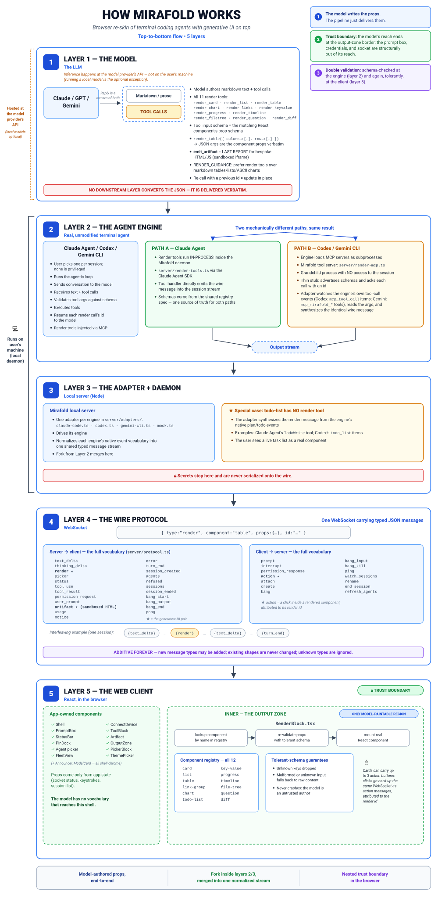

# Mirafold

**Mirafold is a browser interface for the terminal coding agent you already
use — Claude Code, Codex, or Gemini CLI — rendered faithfully, with
generative UI on top.** The agent runs on your own machine, with your own
credentials, settings, memory, and permission rules, exactly as in the
terminal — a Codex user gets **Codex** in the browser, never "Claude
things". As it works, the agent paints live charts, tables, checklists, and
diffs into the session — components that stay live and can act back — and
on Pro the same session travels to your phone through an end-to-end
encrypted relay. Free and open source, MIT.

If you've ever wished the agent's answers were readable instead of a wall
of scrollback, that you could see every running session at a glance and act
on any of them from one grid (mission control), that `sudo` and `ssh`
didn't mean switching to another window (a `!`-prefixed command runs in a
real PTY, in the same page, with the password prompt in a masked input the
agent never sees), or that you could check on a long run from your phone
(Pro) — that's this. And if you've been searching for a web UI, GUI, or
frontend for Claude Code, Codex, or Gemini CLI: this is that.

> **Mirafold is in public beta** — new, moving fast, and issues are wanted:
> the [issue tracker](https://github.com/mirafold/mirafold/issues) is the
> front door for anything that looks wrong.

Under the hood: a full agentic engine — filesystem, bash, tools, a warm
persistent session — runs behind a web front end, and the agent's output
stream is treated as a **UI-instruction stream**. It paints streamed markdown
and live registry components into an output zone, those components act back
through a server-mediated action bridge, and — when no component fits — the
agent emits sandboxed arbitrary UI into a locked-down iframe. A fixed,
trusted shell owns the prompt box, the socket, and all credentials, and the
agent can never touch any of them.

*Claude Code, Codex, and Gemini CLI are trademarks of their respective
owners; Mirafold is not affiliated with or endorsed by Anthropic, OpenAI, or
Google.*

**Know what you're running.** Mirafold drives a real coding agent on your
machine: with your permission it reads and writes files, runs shell
commands, and acts on whatever you point it at. Permission prompts gate
consequential actions, the shell (prompt box, socket, credentials) is
walled off from agent output, and dangerous link schemes are stripped from
the transcript — but an AI agent can be wrong, and text it reads (a web
page, a log, a README) can try to steer it. Review what you allow, treat
links in agent output like links from a stranger, and read
[SECURITY.md](SECURITY.md) for the security model's exact boundaries and
the known trade-offs we've chosen to disclose rather than paper over.

> **The faithful-skin-per-agent model is the identity, and it's shipped (PLAN
> Phase P, complete).** Three terminal agents run behind one front end today —
> **Claude Code** (Anthropic Agent SDK), **Codex** (OpenAI), and **Gemini CLI**
> (Google) — each driving its **own** engine, normalizing its event stream to
> `WireMsg` behind the `AgentSession` seam (§2.2), and carrying Mirafold's
> generative UI via **MCP**. A new agent is one adapter in `server/adapters/`,
> not a rewrite: the wire protocol, output zone, security model, and generative
> UI consume `WireMsg` only. No generic homegrown agent, no proxy, no privileged
> agent — onboarding lets you pick the agent per session. Claude Code is the
> reference adapter, so this document's deeper sections use it for concrete
> examples; Codex and Gemini CLI are the same pattern (`server/adapters/codex.ts`,
> `server/adapters/gemini-cli.ts`).

Think of it as a terminal successor, not a chat app: monospace command strips
in, rich rendered output back. Its transcript contract is **provider-native
fidelity** — show the work state that the selected terminal agent exposes,
neither raw adapter churn the terminal hides nor less useful information.
In-flight work and failures stay visible; when a turn finishes, contiguous
runs of successful tool activity fold to expandable lines whose full normalized
details are still available. An engine that narrates between commands (Codex
thinks before nearly every one) has that interior narration folded along in
true order rather than shattering the run into singletons; the fold's count
speaks of actions only. A fold never crosses a failure, prose, or any other
visible transcript row, so chronology stays exact. Rich generative UI is added
around that transcript, never in exchange for it.

The trusted shell also owns a live **Workspace changes** review surface. It
groups every visible working-tree change by Git repository and opens the real
HEAD-versus-working-tree diff without attributing shared-disk edits to the
agent. On desktop it is a wide split beside the still-visible conversation —
drag-resizable from its default width up to everything except a phone-sized
conversation column, the choice persisted per browser; on phone it is a
full-screen, one-file-at-a-time review with persistent previous and next
controls. A diff opens positioned on its first hunk, so the hunk counter
always describes what the viewport shows, and a live disk refresh updates the
open diff in place without moving the reader. Stable HEAD/current line numbers
and hunk navigation keep the code context exact: desktop supports pointer and
keyboard range selection plus a **Select hunk** toggle (click again to
unselect), while phone supports line and whole-hunk taps. **Explain** and **Request
change** append the selected path, range, and diff to the visible editable
prompt without sending, so feedback still travels through the ordinary trusted
prompt path. Review progress stays local to one browser viewport and binds each
checkmark to the exact bounded HEAD + working-tree bytes the daemon observed;
`R` marks or unmarks that revision and `N` advances to the next unreviewed file
only while focus is outside the prompt. A later disk or HEAD change visibly
removes stale checkmarks: a complete path hint preserves unrelated progress,
while a HEAD change or incomplete hint conservatively clears every marker. The
same conservative reset happens after a reconnect or an explicit Refresh,
when events may have been missed; a late Git-status decoration refresh does
not impersonate a disk mutation. Terminal-newline changes render against the
real final source line with an explicit no-newline marker, never a phantom
blank line. The existing Files view remains the separate answer to "what
exists here?" while Changes answers "what differs from HEAD?"


*The real UI, driven end to end: ask about a repo → an overview card, a
dependency table, and doc links. Then "run the server tests and fix what's
failing" → the shell's own permission strip, the failing run as console
output, a live task list, the fix as a diff, a green re-run — and the
Explorer opens for a look at the actual git diff before the commit.
`!sudo lsof -i :3000` runs in a **real PTY**: the password prompt is answered
in the shell-owned masked bar, and the agent reads the output and replies
unprompted. Then a bundle question → a pie chart, **pinned**, updated in
place by a later turn → and a mermaid diagram in the sandboxed frame.*

This document is the technical orientation for someone taking ownership of the
codebase. Companion documents:

- **[PLAN.md](PLAN.md)** — the phased build plan. Every step has
  Goal / Build / Files / Done-when. Shipped so far: **Phases 0, 1, T, 2, 3, T2,
  and P** (three faithful agent skins — Claude Code, Codex, Gemini CLI), all
  of Phase 4, **G/H/H2** (the 2026-07-15 maintainability restructure this
  document's layout reflects), **S** (the theme system; seven themes at launch),
  **N** (the onboarding backend picker + local-server discovery), **V** (the
  visual/fidelity punch list), **A** (the accessibility floor, WCAG 2.1 AA),
  **C** (CI on every push), **E** + **E2** + **W** (the Explorer — the
  read-only files panel, lazy per-directory since E2 with per-repo git
  fidelity, and self-refreshing since W's filesystem watcher),
  **CR.1–CR.4** (the bounded multi-repository change query, responsive live
  Changes review workspace, visible unsent code-context feedback, and
  revision-keyed review progress),
  **M** (mission control grown into a cockpit: act on sessions from the grid),
  L.1, most of the Phase F fidelity fixes, and the working core of
  **Phase R** (the hosted relay: R.1 dial-out + envelope, R.3 per-pair E2E
  encryption, R.4's QR pairing + phone layout — proven on a real phone — and
  R.2's relay **deployed** on Fly.io). What remains before launch: the R.4l
  polish/fidelity intake, billing (R.5, on a merchant of record — Paddle —
  per Phase K.4), the written release order (R.5b), a user-testing round
  (R.5c), launch prep (R.6), and launch day itself (R.7). **Phase K**, the
  legal & compliance readiness phase opened 2026-07-15, is largely closed
  as of 2026-07-27 (the K.6 claim-accuracy/trademark pass executed that
  day) — remaining: payout details at the billing vendor and the
  revenue-triggered items (LLC, trademark filing, lawyer review).
  Demand-gated Phase L ergonomics follow post-launch. PLAN.md is the
  source of truth for what comes next; completed phases and full status
  histories are archived in **[PLAN-ARCHIVE.md](PLAN-ARCHIVE.md)**.
- **[BUSINESS.md](BUSINESS.md)** — positioning, wedges, pricing, and the
  milestone gates that sequence the plan. The two build-relevant conclusions:
  ship the Phase 1 demo before Phase T, and keep every seam local-first.
- **[docs/ADAPTERS.md](docs/ADAPTERS.md)** — the normative adapter
  specification: what an adapter must/should/may/must-never do, the shipped
  capability matrix per provider, and the exact checklist for adding
  provider #4. Read it before touching anything in `server/adapters/`.

---

## 1. The one-paragraph mental model

**Start here — the spine in six lines (H.13):**

- `server/protocol.ts` is THE contract: every message between server and
  browser is a `WireMsg`/`ClientMsg` defined there, and nothing else crosses.
- `server/index.ts` and `web/src/main.tsx` are the two entry points.
- `server/adapters/` normalizes each terminal agent (Claude Code, Codex,
  Gemini CLI, mock) into that one protocol — one adapter each, none privileged.
- `web/src/components/Shell.tsx` is the TRUSTED shell: prompt, permissions, status —
  agent output can never paint or intercept it.
- `web/src/components/RenderZone.tsx` paints: a pure interpreter of the wire messages.
- `web/src/registry/` is the generative-UI component vocabulary
  (`server/registry-spec.ts` is its schema side).

The server holds **warm agent sessions** in a registry — each adapter keeps
its agent warm its own way: Claude Code is one long-lived `query()` from
`@anthropic-ai/claude-agent-sdk` fed prompts through an async generator (so
the conversation and prompt cache never reset between turns), Codex a
persistent SDK `Thread`, Gemini CLI one process per turn resumed via
`--session-id`/`--resume`;
a WebSocket connection is a *viewport* that attaches to one. The session's
SDK event stream is **normalized into a tiny wire protocol** (`WireMsg`),
buffered for replay, and fanned out to every attached viewport. The browser is split into two zones
with a hard security boundary: a **trusted shell** (prompt box + socket
client, never re-rendered by agent output) and an **output zone** that is
purely an *interpreter* of `WireMsg` — it renders whatever messages arrive
and has no other inputs. Growing the product = adding message types to the
wire protocol and handlers to the interpreter. Nothing else changes shape.



## 2. The two load-bearing contracts

Everything in the repo hangs off two interfaces. Internalize these and you
can navigate the whole codebase.

### 2.1 The wire protocol (`server/protocol.ts`)

The contract between server and browser. Currently on the wire:

```ts
// Server → browser
type WireMsg =
  | { type: "text_delta"; text: string }                           // streamed markdown
  | { type: "prompt_options"; options: PromptOption[] }             // provider-owned
                                                                    // pre-submit / + $
                                                                    // completion catalog
  | { type: "thinking_delta"; text: string }                       // T2.1: reasoning stream
  | { type: "status"; state: "thinking" | "tool"; label?: string } // activity line
  | { type: "turn_end" }                                           // finalize the turn
  | { type: "error"; message: string }
  | { type: "notice"; text: string;                                // F.2: degraded-service
      kind?: "retry" | "compaction" | "rate_limit"                 //   status line (dim)
          | "refusal" | "warning";
      source?: string }                                            //   engine's own words → badged
  | { type: "render"; component: string; props: Record<string, unknown>; id: string }
    // ^ Phase 1: "mount registry component X with props P". Re-sending an id
    //   updates that component in place (the live-pinned-widget mechanism).
    //   `component` is a plain string so unknown instructions stay
    //   representable and can degrade gracefully (Step 1.4).
  | { type: "picker"; id: string; title: string;   // shell-owned selector re-skinning
      rows: { label: string; detail?: string;      //   terminal chrome (/model, /effort):
        current?: boolean; text: string }[];       //   arrow-key + click, any row count;
      hint?: string }                              //   picking sends `text` as the next
                                                   //   user turn (same path as a
                                                   //   question click)
  | { type: "artifact"; html: string; id: string; title?: string } // Phase 3: sandboxed UI
  // Tool records (T.1). T2 widened both with OPTIONAL fields old clients
  // ignore: `input` (full args → diffs/code), `parentId` (subagent nesting),
  // `truncatedBytes` (explicit elision past the output cap).
  | { type: "tool_use"; name: string; detail?: string; id: string;
      input?: Record<string, unknown>; parentId?: string }
  | { type: "tool_result"; output: string; isError?: boolean; id: string;
      truncatedBytes?: number; parentId?: string }
  | { type: "permission_request"; tool: string; detail: string; id: string } // T.3
  | { type: "permission_resolved"; id: string; allow: boolean } // 2026-07-28: the ask
                                                   //   resolved (any viewport's answer,
                                                   //   timeout, interrupt) — every
                                                   //   viewport drops its bar on this
  | { type: "user_prompt"; text: string }              // 4.2: server-echoed user turn
  | { type: "session_created"; sessionId: string; cwd: string;    // 4.2: attach reply
      agent?: AgentName; model?: string;           // (P.4: + agent; F.3/F.8: + model —
      resumed?: boolean }                          //  the status bar shows it from first
                                                   //  paint; absent until the engine
                                                   //  names one — never a stand-in;
                                                   //  4.4: + resumed —
                                                   //  true ⇒ tail replay, don't reset)
  | { type: "agents"; agents: { agent: AgentName; live: boolean }[]; // P.4: onboarding
      default: AgentName; cwd?: string; home?: string;             //   (4.8: + cwd/home)
      folderPicker?: boolean;                         // N2: host dialog is available
      relay?: { url: string; code: string } }        // R.4: pairing info for the QR —
                                                     //   local viewports only
  | { type: "folder_picked"; id: string; path?: string; // N2: local, per-viewport
      canceled?: true; error?: string }                 //   reply; never replayed
  | { type: "usage"; model?: string; inputTokens: number;          // T2.6: status-bar
      outputTokens: number; costUsd?: number }                     //   accounting
  // 4.9: the `!` passthrough's lifecycle + OUTPUT stream (broadcast, replayed).
  // What the user types into the command goes browser→server only (bang_input).
  | { type: "bang_start"; command: string; id: string }
  | { type: "bang_output"; data: string; id: string }
  | { type: "bang_end"; id: string; exitCode: number | null }      // null = killed
  | { type: "pong" }                                     // 4.4: liveness reply
  | { type: "sessions"; sessions: SessionMeta[] };  // 4.6: fleet snapshot for
                                                    //   watch_sessions viewers
// 4.4: the whole union is intersected with { seq?: number } — the registry
// stamps a session-scoped increasing seq on every BROADCAST message (never
// on per-viewport plumbing), giving reconnects a resume cursor.
// 2026-07-29 (additive): messages REPLAYED from the buffer on attach also
// carry { replay?: true }, stamped at replay time — history paints
// identically but live-only side effects (screen-reader announcements,
// above all) don't re-fire per reload. Old clients ignore it.

// Browser → server
type ClientMsg =
  | { type: "prompt"; text: string }
  | { type: "interrupt" }                                       // T.2: halt the turn
  | { type: "permission_response"; id: string; allow: boolean } // T.3
  | { type: "attach"; sessionId: string; afterSeq?: number } // 4.2: join a session…
                                          // (4.4: afterSeq ⇒ tail-only resume)
  | { type: "create"; cwd?: string; agent?: AgentName } //  …or start a fresh one (P.4)
  | { type: "action"; action: Action; sourceId: string } // Phase 2: component action
  | { type: "bang"; command: string; id: string }        // 4.9: run `!cmd` in a PTY
  | { type: "bang_input"; data: string; id: string }     //   EPHEMERAL: PTY stdin —
                                                         //   never broadcast/buffered/logged
  | { type: "bang_kill"; id: string }
  | { type: "ping" }                                     // 4.4: liveness probe
  | { type: "watch_sessions" }             // 4.6: be a fleet watcher, not a viewport
  | { type: "rename"; sessionId: string; name: string }  // 4.6: fleet rename
  | { type: "pick_folder"; id: string; cwd?: string };   // N2: explicit local GUI request
```

`Action` (also in `protocol.ts`) is the complete vocabulary of what a
component interaction may do — `prompt` (round-trips as a user turn), `tool`
(runs a server-side allowlisted tool, §5.4), or `state` (pin/unpin;
output-zone-local, never sent).

**The cardinal rule: later phases ADD message types (or OPTIONAL fields);
existing shapes never change.** That's what makes every phase additive and
keeps old clients from breaking. The union above is complete for everything
shipped. The Phase R relay proves the rule from below: it carries these same
frames as **opaque, end-to-end-encrypted payloads** inside its own tiny
envelope (`server/relay/relay-protocol.ts` — a transport layer under `WireMsg`,
not new message types); the relay sees that ciphertext plus the bare
connection metadata any forwarder handles — IPs, timing, byte counts — never
content or keys. R.4 added exactly one optional field
(`agents.relay`, the pairing info for the connect-a-device QR — sent to
local viewports only, never across the relay).
N2 likewise added only `agents.folderPicker` plus the correlated
`pick_folder`/`folder_picked` pair. The reply is local plumbing: it goes only
to the viewport that clicked Browse and is never broadcast, buffered, or
replayed.

**The `!` passthrough (Step 4.9).** A prompt starting with `!` is
intercepted by the trusted shell and the server runs the rest in a
**real PTY** (`node-pty`) — so unlike the terminal agents' own pipe-based
`!`, interactive programs work: `sudo` prompts, `ssh` host-key questions,
y/n confirms. It runs in the session's bang cwd: `cd` **persists** across
`!` commands, confined to the workspace and its children — an escape is
undone and announced ("Shell cwd was reset to …"), terminal-harness
parity. Output streams to every viewport and the replay ring like anything
else (a silent success is said out loud: "(completed with no output)");
the finished transcript (`<bash-input cwd>`/`<bash-output>`, closing-fence
escaped so output can't fake its way out of the block) goes to the agent
**immediately as its own turn**, so the model sees what you ran and
answers, exactly as the terminal does (agent-neutrally, via `pushPrompt` —
no per-adapter code; a per-session 400ms throttle keeps a hostile client
from burning tokens with bang bursts). Stdin is the one **ephemeral** path:
only the issuing viewport gets the input bar (it auto-masks on password
prompts), and `bang_input` goes straight to the PTY — never broadcast,
buffered, or logged, so a password can't reach the ring or a second tab.
Echo discipline is the terminal's own: echo-on input comes back as PTY
output (visible everywhere, as in a terminal); password prompts turn echo
off, so nothing comes back. A full embedded terminal (xterm.js consuming the
raw stream — `!vim`, `!top`) is deferred Tier 2; today's stream is
ANSI-stripped plain text, one command at a time per session.

Both sides import the *same file*: the web build resolves `@protocol` to
`server/protocol.ts` via a Vite alias + tsconfig path. There is one source of
truth for message shapes, enforced by the type checker on both ends.

### 2.2 `AgentSession` (`server/adapters/`)

```ts
interface AgentSession {
  pushPrompt(text: string): void;              // feed a user turn in
  onMessage(cb: (msg: WireMsg) => void): void; // subscribe to normalized output
  interrupt(): void;                           // T.2: halt the turn; stay warm
  resolvePermission(id: string, allow: boolean): void; // T.3: browser's answer
  readonly resumeId?: string;                  // provider conversation identity
  onResumeId?(cb: (id: string) => void): void; // async identity-ready boundary
  refreshPromptOptions?(): void;               // native command/skill catalog
  close(): void;
}
```

Four implementations live behind this interface in `server/adapters/`, one per
agent plus the mock, and the server (and everything downstream, including the
entire front end) cannot tell them apart — they all emit `WireMsg` and nothing
else. `createSession()` resolves which one from config + per-session onboarding:

- **`ClaudeCodeSession`** — Claude Code via the Anthropic Agent SDK (the
  reference adapter; Claude-specific fidelity is scoped here).
- **`CodexSession`** — OpenAI's Codex via `@openai/codex-sdk` (spawns the
  `codex` CLI, streams its JSONL events → `WireMsg`).
- **`GeminiCliSession`** — Google's Gemini CLI via its headless `stream-json`
  interface (one process per turn, warm across turns via `--session-id`/`--resume`).
  Note: to inject the render MCP server, this adapter writes a
  `.gemini/settings.json` into the session's working directory (merged
  non-destructively over anything already there) — so pointing a Gemini session
  at a project drops that file in it.
- **`MockSession`** — a scripted stand-in used automatically when the chosen
  agent has no credentials. Emits every wire message type with
  realistic pacing, drawing replies from a shuffled deck of five demo
  templates (welcome, analytics report, code review, migration plan,
  research brief), and ends every turn with a schema-valid `render` so the
  Phase 1 component pipeline is exercised API-free.

This is a deliberate development strategy, not a testing afterthought:
**every UI capability is built and verified against the mock first**; live
verification with a real key comes last. You can develop the whole front end
without spending a token.

**What agent #N actually requires (R.4h).** The seam above
undersell the seam's real contract — these properties of the underlying
engine are load-bearing in every shipped adapter, and an agent that lacks one
needs a workaround (or isn't a fit) *before* the adapter is started:

- **MCP over stdio**, so the shell can inject its `render_*` / `emit_artifact`
  tools without touching the agent's request path.
- **The engine's own event stream must show tool results** (not just tool
  calls) — the render tools return a `renderId` acknowledgment, and the
  adapter reads it riding back through that stream to correlate `render`
  messages with the turn that authored them.
- **A discernible turn boundary** — something in the stream that reliably
  means "this turn is over", to emit `turn_end` from.
- **A warm-session mechanism** — either a long-lived process or a
  resume-by-id flag (Gemini's `--session-id`/`--resume`), so a session
  survives across prompts without replaying history. The provider's durable
  conversation identifier must be exposed as `resumeId`; if it becomes real
  only after engine initialization, `onResumeId` announces that exact boundary.
- **A provider-owned pre-submit catalog** when the terminal has one.
  `refreshPromptOptions()` emits a replaceable `prompt_options` snapshot:
  Claude Code reads `supportedCommands()` and `commands_changed`; Codex emits
  its faithfully reimplemented `/model` plus live app-server `skills/list`
  results under `$`; Gemini emits its faithfully reimplemented `/model`.
  Terminal-only commands are omitted when the active headless surface cannot
  execute them as commands—suggesting one and sending it to the model as prose
  would not be provider fidelity.
- **An interrupt** that halts the current turn while keeping the session warm.
- **A way to auto-trust the injected MCP server** (config file, CLI flag, or
  settings merge) — a first-turn interactive "trust this server?" prompt has
  no terminal to answer it here.

The full adapter contract — semantics beyond this TypeScript shape,
the per-provider capability matrix, and the add-a-provider checklist — is
**[docs/ADAPTERS.md](docs/ADAPTERS.md)**, the normative document for this
seam.

## 3. The security model (do not violate)

Two zones in the browser, hard boundary between them:

```
┌─ OUTPUT ZONE — agent-controlled, sandboxed ──────────┐
│   Level 1: styled markdown            (shipped)      │
│   Level 2: registry components        (shipped)      │
│   Level 3: sandboxed-iframe artifacts (shipped)      │
├─ SHELL — TRUSTED, never re-rendered by the agent ────┤
│   prompt box · WebSocket client · all credentials    │
└──────────────────────────────────────────────────────┘
```

The invariants, and where each is enforced today:

- **Provider credentials and configured endpoint URLs never reach the
  browser.** They live only in the server process. A configured endpoint may
  itself contain URL authentication, a signed query, or a private hostname.
  A configured Claude row exposes only a random daemon-scoped `backendId`; a
  Codex row exposes its declared provider identity while keeping the provider
  base URL internal. The daemon resolves either selection against current
  server-side configuration.
  Probe-discovered local servers still carry their explicit address so the
  browser can distinguish their live model catalogs, and the server validates
  every such choice against the current probe cache.
- **The agent only emits content into the output zone.** `RenderZone` is the
  sole consumer of agent output, and it only ever renders — it holds no
  socket, no credentials, no callbacks into the shell beyond subscription.
- **No raw agent HTML outside the sandboxed iframe.** `react-markdown` never
  emits raw HTML from its source by default, so streamed markdown can't
  smuggle script or markup (same rule in the registry's `Md` component).
  Links are forced to `target="_blank" rel="noopener noreferrer"`. The one
  place agent HTML executes is `Artifact.tsx`'s opaque-origin iframe.
- **The shell's voice is the shell's alone** (2026-07-20 audit). Shell-owned
  surfaces are the ones a user learns to trust as *Mirafold* speaking — the
  dim `notice` line most of all, since the rest of its family (retry,
  compaction, rate limit, refusal) is shell-authored prose. So any string
  taken **verbatim from an engine** and rendered on such a surface must be
  attributed to that engine, visibly, or it can pose as us: a model — or
  whatever a model just read in some repo — could emit "session credential
  expired, re-enter your key at …" and have it render as a system line.
  Codex's non-fatal `ErrorItem` rides `notice.source: "codex"` and renders
  badged behind a dashed rule instead of the shell glyph. Provider/repository
  prompt-catalog metadata follows the same rule: Claude commands and Codex
  skills carry a fixed adapter-assigned source badge, never a provider-chosen
  attribution; invisible direction/line controls cause the entire option to
  be dropped before trusted-shell rendering or persistence. Anything
  engine-supplied that already sits in an
  agent-attributed frame (assistant turns, tool blocks, the permission bar,
  which announces itself as the agent asking) needs nothing further. **Adding
  an adapter: compose the sentence yourself and it's ours; pass the engine's
  own words through and it must carry `source`.**
- **Tool use is gated server-side** (`server/security/permissions.ts`, see §5.3);
  anything outside the auto-allowed set pauses the turn on a shell-drawn
  permission bar in the browser, deny by default (T.3).
- **Component actions are mediated server-side** (`server/sessions/actions.ts`, see
  §5.4): the client never makes an arbitrary call; `tool` actions run against
  an explicit allowlist with validated args, and every action is logged.
- **WebSocket hijacking guard**: browser connections must present a loopback
  `Origin`; a malicious web page can't drive your local agent through a
  cross-site socket. Non-browser clients (wscat, tests) send no Origin and
  pass — they aren't weaponizable the way a browser socket is.
- **Per-launch auth token** (`server/index.ts`, Step 4.5): loopback keeps the
  network out, but "same machine" includes other user accounts on a shared box —
  and the socket drives a shell. A random token generated each launch gates both
  the served app and the WebSocket: the launcher opens a URL carrying it, the
  browser stores it as an `HttpOnly; SameSite=Strict` cookie (so refreshes, new
  tabs, and fleet links just work), and connections without it get a 403 / a
  refused handshake. Set `MIRAFOLD_TOKEN=""` to disable it on a single-user machine
  (the dev server does this — the Vite `:5173` proxy is cross-origin and can't
  present the cookie); set `MIRAFOLD_TOKEN=<value>` to pin one. **With auth off the
  loopback-Origin guard is the only gate, and it admits any page served from
  localhost on any port** — so another local dev server, or a hostile package's
  local server, could drive the agent. Keep auth on outside the single-user dev
  case; the daemon logs a loud warning at startup when it's off.
- **The daemon's own `.env` is never readable through a tool**
  (`server/security/permissions.ts`): the secret-path guard denies `Read`/`Grep`/`Glob`
  at `.env`/`.env.local`, and `WebFetch`/`WebSearch` are not auto-allowed (they
  ask, like the terminal) so a prompt injection has no silent read→exfil path.
  Defense-in-depth, not a full boundary.
- **Resource caps**: one inbound WS frame is capped (`MAX_WS_PAYLOAD`, 1 MB) and
  concurrent sessions are capped (`MAX_SESSIONS`, 100) so a runaway or hostile
  local client can't exhaust memory/PTYs. The shell page also ships
  defense-in-depth headers (CSP, `nosniff`, `X-Frame-Options: DENY`).
- **The relay is untrusted for resource pressure too** (`server/relay/relay-client.ts`):
  viewport announcements past `MAX_REMOTE_VIEWPORTS` (16) are refused, and a
  handshaken viewport with no authenticated frame for `RELAY_VIEWPORT_IDLE_MS`
  (90 s) is dropped — so a hostile relay (or a replayed handshake hello, which
  can never produce an authentic frame) can't park connections or grow daemon
  state. A pinned `MIRAFOLD_RELAY_CODE` under 16 chars is refused at startup with
  a minted fallback: the code is the remote path's only credential, and a
  guessable one would be brute-forceable remote shell access.

Agent-authored executable UI (Phase 3, shipped) runs only inside
`web/src/components/Artifact.tsx`'s sandboxed iframe: `allow-scripts` without
`allow-same-origin` gives the content an opaque origin (cookies, storage, and
the parent DOM are structurally unreachable), and an injected
`default-src 'none'` CSP cuts every network path — verified against a hostile
artifact with every escape probe blocked; the threat model is documented
inline in the file. Artifacts talk back through exactly one channel: a
nonce-stamped postMessage bridge (`genui.prompt` / `genui.tool`) validated at
every hop (source window, opaque origin, per-mount nonce, strict shape,
rate limit) and forwarded through the same server-side allowlist mediation
components use. Broken artifacts degrade to their source as styled code, and
a self-navigating artifact is detected by liveness and blanked. The trusted
shell is why this product can safely let an agent paint UI at all — treat the
boundary as inviolable, and treat "the shell draws it, the agent can't fake
it" as the extension of the same rule: the pin affordance (a frame *around*
rendered blocks, unreachable from agent props), the T.3 permission bar, the
artifact's "sandboxed" chrome, and the status bar are all drawn this way.

## 4. Repository layout

```
server/            the local daemon (Node, run with tsx)
                   — the ROOT is the spine: entry points + shared contracts.
                   index.ts and render-mcp.ts never move (installed daemons
                   resolve them by path); each subsystem below is a folder.
  index.ts           ENTRY POINT: Express + ws server; connections attach as
                     viewports
  render-mcp.ts      ENTRY POINT: the render_* tools as a standalone stdio
                     MCP subprocess (Codex/Gemini adapters spawn it)
  render-tools.ts    render_* tools as an in-process MCP server (Claude
                     adapter) + RENDER_GUIDANCE
  protocol.ts        WireMsg/ClientMsg/Action — the shared wire contract
  folder-picker.ts   local-only host dialog recipes (macOS/Windows/Linux),
                     executable lookup, validation, and credential-safe spawn
  registry-spec.ts   zod shapes per component — spec = tool schema = validation
  provider-policy.ts the dated per-provider credential-policy matrix (R.4i) —
                     cited by path from CLAUDE.md/BUSINESS.md; stays at root
  version.ts         reads package.json's version at build time (R.4g)
  adapters/          one AgentSession per agent: claude-code.ts, codex.ts,
                     gemini-cli.ts, mock.ts. Codex's lifecycle stays in
                     codex.ts; codex-{binding,commands,diagnostics,events,
                     prompt,rollout}.ts own its named internal seams. Shared
                     index/types/queue/render-MCP and provider catalog helpers
                     live beside them, with *.spike.md probe notes.
  sessions/          the session state core (H.4/H.5):
    registry.ts        SessionRegistry: sessions decoupled from connections (4.2);
                       broadcast() is also where engine-supplied labels are
                       length-capped (LABEL_CAP), ahead of the ring, the
                       cockpit derivation and every viewport (2026-07-29)
    session-store.ts   owner-only atomic checkpoints: bounded transcript,
                       exact backend metadata, and provider resume id; startup
                       indexes them as dormant sessions for lazy recovery
    connection.ts      one viewport's server side, transport-agnostic (R.1) —
                       shared verbatim by local sockets and relay viewports
    folder-picker-handler.ts
                       per-viewport native-picker request/reply boundary;
                       explicitly unavailable through the relay
    actions.ts         Phase 2 mediation: allowlisted tools component actions may run
    bang-handlers.ts   the `!` passthrough's request layer (4.9): the bang/
                       bang_input/bang_kill handlers connection.ts delegates to,
                       plus the output budgets, cwd handoff, and agent-turn
                       transcript (the PTY runner itself stays in pty/)
    fs-handlers.ts     Explorer + Changes request layer: the fs_list/fs_listdir/
                       fs_read/fs_diff/fs_changes handlers connection.ts
                       delegates to — per-viewport replies, jailed + throttled,
                       one reply each; fs_diff also returns the bounded exact
                       revision token used by viewport-local review progress
    fs-explorer.ts     Explorer data layer: the capped tree walk (E.1) + the
                       per-directory lister behind the lazy tree (E2.1) +
                       jailed, secret-safe, binary-sniffing file reads; Changes
                       can opt into a 1 MB-bounded opaque content revision
    git.ts             Explorer/Changes git layer: bounded one-shot git calls for the
                       tracked tree + statuses + HEAD-vs-working diffs (E.2),
                       plus the per-repo view the lazy tree uses — nearest-.git
                       discovery, cached+serialized status, ignore-aware
                       decoration (E2.3) — and the complete changed-file query,
                       with bounded nested-repo discovery below a non-repo
                       workspace root (CR.1). NOTE: nearest-repo discovery
                       walks ABOVE the
                       session root when the session is scoped inside a repo;
                       SECURITY.md states the bound (nothing outside the scope
                       reaches the wire), pinned by a Tier-2 test
    git-trust.ts       what a repo's OWN git config would make git run, and how
                       to stop it (2026-07-26 audit): the daemon runs git
                       automatically when a panel opens, so a browsed repo's
                       configured programs are neutralized by default and the
                       user allows a repo explicitly. SECURITY.md carries the
                       vector list + the probe method that established it
    fs-watch.ts        the live tree's doorbell (Phase W): one @parcel/watcher
                       subscription per session, alive only while a viewport is
                       attached — coalesced per window, exclusion-aware, with a
                       count- and byte-capped paths hint; heals the inotify
                       backend's missed-fast-subtree gap by resubscribing
    ws-liveness.ts     heartbeat sweep shared by the local and relay socket paths
  security/          the two trust gates (H.6):
    auth.ts            the 4.5 auth predicates (token cookie, loopback Origin) —
                       pure functions; index.ts wires them into HTTP + WS
    permissions.ts     canUseTool policy: workspace gating + browser prompts (T.3)
  pty/               the `!` passthrough (H.7):
    pty.ts             the PTY runner (node-pty, 4.9)
  relay/             the remote-viewport path (H.2/H.3):
    relay-protocol.ts  the relay envelope + pairing-code mint (R.1/R.3)
    relay-crypto.ts    per-pair E2E encryption, WebCrypto-only — the same file
                       runs in the browser via the @relay-crypto alias (R.3)
    relay-client.ts    daemon dial-out: no listening port for remote access (R.1)
    relay-stub.ts      in-repo dumb-forwarder stub for dev + tests
    relay-test-client.ts  shared RemoteClient test helper (the browser side of
                       the encrypted relay channel) used by relay.itest.ts and
                       relay-service.itest.ts
                     NOTE: the hosted relay itself lives in the SIBLING repo
                     `mirafold-relay` (its single source of truth; MIT since K.1,
                     public since 2026-07-31). relay-service.itest.ts
                     (Tier 2) imports the relay under test from
                     ../mirafold-relay/src/ and guards the routing contract
                     against relay-protocol.ts — clone mirafold-relay next to
                     this repo + `npm install` inside it to run that test;
                     without the sibling, the rest of Tier 2 is unaffected
  testing/           cross-cutting test infrastructure (H.8): itest-harness.ts
                     (spawns the real daemon for Tier 2/3) + e2e-harness.ts
                     (shared browser-e2e helpers: Chrome launch, the axe
                     accessibility gate, noSideScroll) + the whole-product
                     e2e suites (app, launcher, phone, resilience)
web/               the browser app (React 19 + Vite)
  index.html         entry html
  src/main.tsx       mounts <Shell/>, imports highlight theme + every theme
                     palette (glob) + structural CSS
  src/components/    the shell-owned components — trusted UI, every file here
                     (H2.1); the agent-paintable vocabulary is its SIBLING,
                     registry/, so the trust split reads in the tree
    Shell.tsx          TRUSTED SHELL: prompt box + notices + status bar + the
                       activity bar (desktop's left strip for the mutually
                       exclusive Files and Changes workspaces; on phone both
                       toggles fold into the status bar); consumes the session
                       bus (H.9)
    Onboarding.tsx     first-run card: pick the agent + working directory, then
                       how it's backed when there's a choice — detected
                       credentials + discovered local model servers (P.4/4.8/N.4)
    PromptBox.tsx      the command bar (auto-grows to 8 lines; Enter sends on
                       desktop — on phone Enter is a newline and the ↑ button
                       sends, R.4l); native pre-submit / and $ completions +
                       transcript-click focus path
    BangBar.tsx        the `!` command's stdin bar (4.9): per-viewport input
                       with password auto-masking — ephemeral, never broadcast
    PermBar.tsx        the permission strip + its full-command card (2026-07-28):
                       the strip's body is one tap target opening the whole
                       command in a ModalCard — the phone's truncated preview
                       was unreadable; Shell keeps owning asks + the wire answer
    RenderZone.tsx     OUTPUT ZONE: WireMsg interpreter → entries, incl.
                       thinking blocks, artifacts, subagent grouping, and the
                       completed-turn activity fold
    ActivityLine.tsx   the always-visible work indicator (4.14): cycling
                       asterisk + label + elapsed seconds, prompt-area chrome
                       above the box — never a transcript entry, so no scroll
                       position can hide it; Shell owns the label and the
                       open-turn count that keeps it up across a queued turn
    ToolBlock.tsx      tool-call records: collapsed row, expands to input diff +
                       output with elision marker (T.1/T2.2/T2.3)
    StatusBar.tsx      workbench strip (T2.6; regrouped 4.11): home ⌂ + new
                       far left, conn dot, agent · model · session · cwd ·
                       usage · version, the settings gear, theme pill, end far
                       right; sits INSIDE the workbench column (2026-07-25) so the
                       activity bar's border line runs unbroken to the window
                       bottom; folds to one row of controls at phone width
                       (R.4l), where it also hosts the Files and Changes
                       workspace toggles (the activity rail is desktop-only)
    GearGlyph.tsx      the settings/tool gear as a flat outline drawing, three
                       homes: the settings button, the subagent head, the
                       fleet activity line (2026-07-25 — the ⚙ character
                       rendered from the color-emoji font and clashed with
                       every glyph beside it)
    FilesGlyph.tsx     the Explorer/files glyph drawing — the activity-bar
                       toggle and the status bar's phone-width .sb-files
    ChangesGlyph.tsx   the workspace-changes glyph drawing — the activity-bar
                       toggle and the status bar's phone-width .sb-changes
    ArmedButton.tsx    the two-click destructive button (#11's arm → 3s
                       auto-disarm), shared by StatusBar + FleetView's end/stop
    PinDock.tsx        right-side dock for pinned components (live via entries)
    Artifact.tsx       Level 3 host: sandboxed iframe for agent-authored UI (Phase 3)
    FleetView.tsx      mission control at / (4.6; Phase M cockpit 2026-07-24):
                       live session rows — status carried by the colored dot
                       alone — with per-row acts (answer a pending permission,
                       interrupt, quick prompt, ▾ details), rename, new-session
                       affordance; routing lives in main.tsx
    ConnectDevice.tsx  shell-owned "⧉ pair" affordance: QR of the pairing
                       URL, status bar + fleet header (R.4)
    ThemePicker.tsx    shell-owned settings card (S.4): Session facts section
                       (R.4l — the phone's home for folder/model/usage) + theme
                       list grouped by appearance, swatch chips, live apply
    ModalCard.tsx      the one modal scaffold (2026-07-23 refactor): backdrop
                       dismiss + dialog ARIA + Escape + focus trap, shared by
                       ConnectDevice/ThemePicker/Onboarding — mount only while
                       open
    files/             the Explorer panel (Phase E): FilesPanel.tsx (tree +
                       drill-in — docked left column on desktop, full-screen
                       dialog on phone; desktop ⤢ enlarges the file box into
                       a dimmed lightbox, E.6) + FileView.tsx (content /
                       diff / binary) + ExplorerNodeGlyph.tsx (small
                       dependency-free folder/symlink/file-family glyphs) +
                       use-file-view.ts (the reusable correlated read/diff
                       lifecycle shared with the Changes surface, CR.1)
    changes/           the live shell-owned repository/file review workspace:
                       ChangesPanel.tsx composes the surface,
                       use-changes-controller.ts owns requests/live state,
                       ChangesChrome.tsx owns its responsive panel chrome,
                       ReviewDiff.tsx owns line/hunk selection and drafts,
                       ReviewRows.tsx owns bounded shared syntax rendering,
                       use-hunk-navigation.ts owns hunk position/scrolling
                       (first-hunk landing, deferred post-commit jumps), and
                       panel-resize.tsx owns the desktop drag-to-resize
                       separator (CR.2–CR.11)
  src/registry/      Card, List, Table, LinkGroup, Chart, TodoList, KeyValue,
                     Progress, Timeline, FileTree, Question, Diff, Stat, Code,
                     StatusList, Console, Image, Diagram, Md, CopyButton +
                     RenderBlock (validate → fallback → error boundary) +
                     ActionRow/context. Two of them render agent content
                     OUTSIDE the shell origin: Diagram runs mermaid in an
                     artifact-grade sandboxed iframe (§3), and Image draws
                     only a daemon-resolved data: URI (server/render-image.ts
                     does the jailed read; the agent authors a path, never
                     bytes)
  src/session-bus.ts the shell's message bus (H.9): one SocketClient + the
                     pub/sub fan-out and senders Shell.tsx consumes, including
                     correlated Explorer/Changes filesystem queries
  src/changes.ts     pure changed-file grouping, deterministic selection,
                     count honesty, status labels, and repository labels
  src/change-review.ts
                     pure versioned-line, hunk, selection, and exact feedback-
                     draft model plus interactive-size and reduced-motion
                     policy for conversational change review
  src/review-progress.ts
                     pure viewport-local reviewed-revision, watcher
                     invalidation, pruning, count, and next-unreviewed model
  src/tool-visibility.ts
                     pure settled-activity fold model: which contiguous
                     successful calls — with the narration between them
                     absorbed in order — compact into one `worked · N
                     actions` record (UX.10)
  src/prompt-draft.ts
                     preserves composed prompt text while appending a visible,
                     unsent Changes feedback draft
  src/folder-picker-requests.ts
                     correlated local picker requests shared by the session
                     shell and the fleet's new-session card
  src/tab-status.ts  the tab status light: brand-M favicon + corner badge
                     (busy / permission) and title, painted from wire state
  src/use-escape.ts  useEscapeKey — the one Esc idiom behind every overlay
                     and the busy interrupt
  src/use-focus-trap.ts  useFocusTrap — focus in on open, Tab cycles inside,
                     restored to the opener on close; wired into every
                     overlay via ModalCard.tsx (A.3). Traps Tab but doesn't hide the rest of
                     the page from the accessibility tree by itself — that's
                     `.behind-dialog { display: contents }` + `inert` in
                     styles.css, applied around everything but the open
                     dialog in Shell.tsx/FleetView.tsx (A.3, Orca walk)
  src/use-armed-confirm.ts  useArmedConfirm — two-click confirm for a
                     destructive control (#11): arm, auto-disarm after 3s;
                     the end-session buttons in StatusBar + FleetView
  src/diff.ts        the LCS line differ shared by ToolBlock's Edit/Write
                     diffs and the `diff` registry component (the per-line
                     JSX lives once, as `DiffLines` in registry/Diff.tsx) —
                     the Explorer's FileView reuses it too (E.3)
  src/files-tree.ts  the Explorer's shell-owned lazy per-directory store (E2.2):
                     one DirState per directory the panel has asked about
                     (unfetched/loading/loaded/refetching/error), pure
                     transitions, kept off the agent surface. Replaced the
                     original flat→nested whole-tree builder (E.3) when the
                     panel went lazy — the client no longer fetches whole trees
  src/use-is-phone.ts  live matchMedia phone-width hook — re-renders on a
                     breakpoint cross, unlike PromptBox's module-load constant (E.4)
  src/tildify.ts     ~-abbreviation for cwd display (prompt + status bar)
  src/relay-pairing.ts  the pairing-fragment/storage layer (R.3/R.4): #code=
                     parsing, the capped-age sessionStorage stash, and
                     newSessionHref — split from ws.ts so the socket client
                     and the pairing pure functions read separately
  src/ws.ts          SocketClient: typed send/onMessage, hello, seq cursor,
                     heartbeat (half-open detection) + capped backoff (4.4);
                     on a relay page (#code= fragment) it handshakes and
                     seals/opens every frame via @relay-crypto (R.3)
  src/agents-meta.ts display labels + per-agent "how to connect" hints,
                     reached only via agentLabel()/connectHint() so an
                     unknown agent name degrades to its raw string (R.4h)
  src/version.ts     the web bundle's own build version (R.4g)
  src/styles.css     the import spine: numbered @imports of src/styles/, one
                     file per surface, top of the screen down (split 2026-08-12
                     from the former single file; same cascade, byte-identical
                     bundle). Its header maps the surfaces and the
                     order-sensitive spots. Structural CSS only — every color
                     via var(...) (see §7) — and the ONE phone media block
                     stays last as styles/15-phone.css
  src/styles/        the 15 surface files the spine imports, in cascade order
  src/themes/        the palettes (Phase S): base.css (pinned code/diff
                     tokens) + one self-contained file per theme; manifest.ts
                     is the single source (THEMES, the token contract, the
                     Base16 porting recipe); themes.test.ts guards it all
bin/               mirafold launcher (4.10): spawns dist-server, opens browser
demo/              the M1 demo GIF embedded at the top of this README
docs/              ADAPTERS.md — the normative adapter specification (§2.2);
                   local-models.md — running against Ollama/LM Studio/vLLM,
                   or a hosted open-model API you pay for (§8)
dist/              built front end (vite build output; served by Express)
dist-server/       esbuild server bundles (4.10): index.js + render-mcp.js —
                   what the installed `mirafold` actually runs; gitignored
PLAN.md            the phased build plan (source of truth for next steps)
PLAN-ARCHIVE.md    completed phases (0, T, 1, 2, 3, T2, P, G, H, H2, S) and
                   the done steps + status histories of the open phases
                   (4, R, F, L, K, Q), all verbatim
BUSINESS.md        strategy; gates that sequence the plan
CONTRIBUTING.md    contributor guide: DCO sign-off (`git commit -s`) + the
                   test-tier and non-negotiable rules (K.9)
SECURITY.md        private vulnerability-disclosure channel + response
                   promise (K.7)
vite.config.ts     web root, @protocol/@relay-crypto aliases, /ws proxy → :3000
tsconfig.json      one tsconfig for both sides; @protocol/@relay-crypto paths
.env.example       MIRAFOLD_AGENT + per-agent credentials/models (ANTHROPIC_API_KEY /
                   DEFAULT_MODEL, OPENAI_API_KEY / CODEX_MODEL, GEMINI_API_KEY /
                   GEMINI_MODEL) + PORT
```

Tests live beside their source, tier picked by suffix — `*.test.ts` /
`*.itest.ts` / `*.e2e.ts` (§8) — so they're omitted from the tree above.

There is intentionally **no** shared `common/` package, monorepo tooling, or
build step for the server — the repo is one yarn package, the server runs
TypeScript directly via `tsx`, and the single shared file (`protocol.ts`)
crosses the boundary via a path alias.

## 5. The server, top to bottom

### 5.1 `index.ts` + `registry.ts` — transport and the session registry

Express serves `dist/` (the built front end; in dev you use Vite's server
instead) plus `/` (mission control, 4.6) and `/s/<id>` as client-side routes,
and hosts a `ws` WebSocketServer at `/ws`. Both the HTTP app and the socket are
gated by the per-launch auth token (§3) behind the loopback-Origin guard — the
pure predicates live in `server/security/auth.ts`, wired in here; a capped inbound
frame (`MAX_WS_PAYLOAD`) and session ceiling (`MAX_SESSIONS`) bound resources.

**Sessions are decoupled from connections** (Step 4.2). A connection is a
*viewport* onto a session in the `SessionRegistry`: its first message is a
hello — `attach` (session id taken from the `/s/<id>` URL) or `create` — and
the server replies `session_created`, replays the session's buffered history,
then subscribes the socket to the live stream. Every emitted `WireMsg` is
fanned out to all attached viewports and kept in a ring buffer — with one
pre-step: consecutive same-type `text_delta`/`thinking_delta` merge on a
33 ms window (`DELTA_COALESCE_MS`, 0 disables; any other message flushes
first, so order is exact), so the ring, viewports and relay all carry the
merged frame, ~3× fewer for streamed text (2026-07-27 perf pass). The ring
holds 4000 messages (and additionally 32 MB — `SESSION_BUFFER_MAX_BYTES`,
2026-07-27 audit: the count cap alone assumed text-sized messages, which
`render_image` broke) for replay, so a refresh or a second tab repaints the
same transcript. **Reconnects resume, they don't repaint** (4.4): every broadcast
message carries a session-scoped `seq`; a reconnecting viewport sends the
last seq it saw and, when the tail is still buffered, the server replays
only the unseen messages under `session_created{resumed:true}` — mid-turn
streaming continues into the same DOM block, pins and scroll survive. A
cursor that has fallen off the ring (or a fresh page) takes the full-replay
path as before.

The ring and provider identity are also checkpointed to the platform state
directory (`$XDG_STATE_HOME/mirafold/sessions`, normally
`~/.local/state/mirafold/sessions`; `%LOCALAPPDATA%\mirafold\sessions` on
Windows; `MIRAFOLD_SESSION_DIR` overrides it). The directory is owner-only and
each bounded JSON record is replaced atomically with owner-only permissions.
These files necessarily contain the transcript—user prompts, normalized tool
inputs/results, and assistant output—plus the exact server-side backend choice
and Claude/Codex/Gemini resume identifier. They do not contain standalone
provider API keys/tokens, but a configured endpoint URL can itself contain URL
authentication or a signed query and is therefore sensitive; this is why the
record and directory are owner-only and the URL never rides the browser wire
or raw logs. User prompts and terminal boundaries are durable before their
wire acknowledgment, while high-volume interior stream frames share a short
checkpoint debounce. Persisted transcript frames are decoded through a strict
allowlist of sequenced transcript message schemas; malformed frames,
per-viewport plumbing, replay stamps, unsafe catalog controls, and out-of-order
sequences make the checkpoint unavailable rather than re-entering trusted
shell state. A configured Claude endpoint is pinned through the one-click path.
Its selected header-credential mode is bound to that exact destination:
recovery refuses if an authenticated endpoint or mode changed, while a saved
discovered/unauthenticated endpoint always strips both real Anthropic
credentials.

Closing a tab merely detaches. After the idle timeout (default 4 h,
`SESSION_IDLE_TIMEOUT_MS`) the warm engine unloads but its dormant checkpoint
stays in mission control. Daemon startup indexes those records without eagerly
launching agents; opening one lazily reconstructs the bounded transcript and
resumes the same provider conversation. Viewportless fleet quick prompts arm
the same unload timer as ordinary detached sessions. A restart during a turn closes that
browser turn with an explicit interruption notice, then leaves the provider
conversation ready to continue. **End Session is the normal deletion path.**
A corrupt checkpoint or unavailable original backend errors in place and is
never silently replaced; a failed checkpoint deletion likewise leaves the live
engine and watcher usable instead of half-ending the session. Only a genuinely
unknown id falls back to a fresh session with the shell-owned explanation.

Each session runs in a real working dir — default: the directory the daemon
was launched from, exactly like a terminal agent (Step 4.8) — or any existing
directory typed at onboarding (`~` expands; a missing path rejects the create,
like `cd`). Mental model: session ≈ project.

Inbound messages route accordingly: `prompt` is echoed onto the session
stream as `user_prompt` (all viewports render the command strip identically —
there is no local echo) and pushed into the session; `interrupt` and
`permission_response` forward to the session; `action` hits the Phase 2
mediation path (§5.4).

### 5.2 `adapters/claude-code.ts` — the warm Claude Code session

`ClaudeCodeSession` is the reference adapter (Codex and Gemini are the same
`AgentSession` shape — §2.2 — driving their own engines). Its key mechanics:

- **One `query()` for the life of the object.** The SDK call's `prompt` is
  an async generator (`promptStream`) backed by a tiny unbounded
  `AsyncQueue`. `pushPrompt(text)` pushes into the queue; the generator
  yields it to the SDK as a user message. Because the query never ends
  between turns, the conversation stays **warm and prompt-cached** — this is
  the "warm session loop" and it's why multi-turn feels instant and cheap.
- **`pump()` normalizes SDK events into `WireMsg`:**
  - `stream_event` → `content_block_delta` (text) becomes `text_delta`
    (enabled by `includePartialMessages: true`, which is what gives
    token-level streaming rather than whole-message chunks); a `thinking`
    delta becomes `thinking_delta` (T2.1 — the reasoning stream, folded
    client-side); `content_block_start` for a tool_use block becomes
    `status:{state:"tool", label:<tool name>}`.
  - Full `tool_use` blocks become `tool_use` records (Phase T.1) carrying the
    one human-salient argument as `detail` **and** the full `input` (T2.2 —
    the client renders Edit/Write inputs as diffs/code); a later `tool_result`
    with the same id completes the record, capped by `capOutput` with an
    honest `truncatedBytes` (T2.3). Results are only forwarded for ids the
    session announced.
  - **Subagent traffic** (events with a `parent_tool_use_id`): its text and
    thinking stay dropped — a subagent's monologue must not paint into the
    transcript — but its tool *calls* are now forwarded tagged with
    `parentId` (T2.4), which the client nests under the owning Task row.
  - **Task list** (T2.5): the SDK's `TaskCreate`/`TaskUpdate` family (its
    successor to `TodoWrite`) is folded into one live `todo-list` render that
    updates in place; the raw Task* rows and their results are swallowed.
  - `result` → `error` (if `is_error`) then a `usage` record (T2.6 —
    per-turn tokens plus the SDK's cumulative `total_cost_usd`) then always
    `turn_end`.
- **`interrupt()`** (Phase T.2) halts the in-flight turn via the SDK; the
  session stays warm for the next prompt.
- **Permission prompts** (Phase T.3): when `permissions.ts` needs the user,
  the session emits `permission_request` and blocks that tool call until
  `resolvePermission(id, allow)` arrives from the browser — or denies on
  timeout (default 60 s, `PERMISSION_TIMEOUT_MS`). Deny is the default
  posture on timeout, disconnect, and interrupt.
- **`close()`** pushes a sentinel that ends the generator and calls
  `interrupt()` on the SDK query.
- Session options: `cwd` is the session's own workspace dir handed in by the
  registry (created on construction — spawning into a missing cwd fails with
  a misleading SDK error), model comes from `DEFAULT_MODEL` (unset → the
  SDK's own default; `.env.example` suggests `claude-sonnet-4-6`, with
  `claude-opus-4-8` switchable per the locked decisions), and `canUseTool`
  comes from `permissions.ts`. `settingSources`
  is left **unset on purpose**, which matches the CLI default (user + project
  + local): Mirafold is a different *view* of the terminal, so a user's own
  Claude Code config — their `settings.json` permission allowlists/deny rules,
  their CLAUDE.md, their memory — applies here exactly as in the terminal.
  Switching to this from regular terminal use must be seamless and
  unsurprising, so honoring those settings (and letting "remember X" write to
  the real memory dir) is correct, not a leak. `canUseTool` still runs for
  anything the user's own rules don't already decide.
- **Generative UI (Phase 1):** the session mounts an in-process MCP server
  (`server/render-tools.ts`) exposing side-effect-free `render_card` /
  `render_list` / `render_table` / `render_chart` / `render_links` /
  `render_keyvalue` / `render_progress` / `render_timeline` /
  `render_filetree` / `render_question` / `render_diff` / `render_stat` /
  `render_code` / `render_statuslist` / `render_console` / `render_image` /
  `render_diagram` tools
  whose input schemas are the registry spec (`server/registry-spec.ts`) plus
  an optional `id` for update-in-place. The one tool that is not purely a
  drawing instruction is `render_image`: the agent authors a workspace PATH
  and the DAEMON inlines the bytes (`server/render-image.ts` — realpath
  containment, secret denial, 2 MB cap, raster magic-byte allowlist), so the
  workspace dir is a required argument on both render paths. Calling one emits a `render` WireMsg
  at that point in the stream and returns the id to the model.
  `RENDER_GUIDANCE` (appended to the `claude_code` system-prompt preset)
  teaches when to prefer a component over prose — and that raw HTML/SVG
  renders as literal code, so the agent never improvises markup (arbitrary
  visuals are Phase 3's sandboxed artifacts). The tool schemas' `.describe()`
  strings are written for the model. The agent reaches for components
  unprompted — verified live.

`MockSession` implements the same interface with `setTimeout`-scheduled
emissions: streamed `thinking_delta`, fake `tool_use`/`tool_result` records
(incl. an Edit with a real before/after and a Write), a `usage` record, the
reply streamed in 16-char chunks at ~12ms, then `turn_end`. Keyword hooks in
the prompt drive every other capability API-free — `artifact`/`broken`/
`navigates` (Phase 3 + its fallbacks), `subagent`/`delegate` (nested Task),
`todo`/`plan` (live checklist), `huge` (the elision marker), `dangerous`
(permission prompt). `close()` clears all pending timers.

### 5.3 `permissions.ts` — the tool policy

`makeCanUseTool(workspaceDir, ask)` returns the SDK's `canUseTool` callback.
The posture is **match the terminal**. Because the session inherits the user's
Claude Code `settings.json` (§5.2), the SDK's own allow/deny rules resolve
**first** — anything the user allowlisted runs without a prompt, anything they
denied is blocked — and `canUseTool` is only the interactive fallback for
undecided calls: the terminal's approval prompt, drawn on the shell's permission
bar instead of the TUI. Deny is the default on timeout, disconnect, and Esc.

1. **The daemon's own `.env`/`.env.local`** → denied to every auto-allowed
   read tool that takes a path (Read, NotebookRead, Grep, Glob), so the read
   side of a read→exfil chain is blocked. Defense-in-depth (the API key lives
   there): still string-based, so `Bash cat .env` isn't caught here — but Bash
   asks.
2. **Local read-only tools** (Read, Glob, Grep, TodoWrite, Task, NotebookRead)
   and our side-effect-free `mcp__ui__*` render tools → allowed without a
   prompt.
3. **Network tools (WebFetch, WebSearch) and everything consequential**
   (Write/Edit/MultiEdit/NotebookEdit, Bash, and any unknown tool) → **asks**.
   The terminal prompts on undecided fetches too, and asking denies a prompt
   injection a silent exfil egress. There is deliberately no "auto-allow inside
   the workspace" — the terminal doesn't do that, so neither do we; a user who
   wants specific commands promptless allowlists them in `settings.json`
   exactly as in the terminal. (An interim build auto-allowed in-workspace
   bash/writes and heuristically confined Bash with a regex; both were
   deviations from terminal parity, removed 2026-07-05.)

### 5.4 `actions.ts` — component action mediation (Phase 2)

`tool` actions emitted by rendered components run **here**, never in the
client: an explicit allowlist (`ACTION_TOOLS`) maps names to zod-validated
args and a handler scoped to the session's workspace. Off-list names and
invalid args are rejected and logged; every run is logged. The result is
broadcast to all viewports as a `tool_use`/`tool_result` pair, so an
action's effect is a visible transcript record. (`prompt` actions round-trip
through the server as a normal user turn; `state` actions never leave the
output zone.)

## 6. The front end, top to bottom

### 6.1 `Shell.tsx` — the trusted shell and its message bus

`Shell` builds (once, in a `useState` lazy initializer) a tiny **bus**: a
`SocketClient` plus a listener set. (`useState`, not `useMemo`, is
load-bearing: React's Fast Refresh re-runs `useMemo` on every dev hot edit —
dependency lists are deliberately ignored — and each re-run opened a fresh
socket while the orphaned one stayed attached, inflating the fleet's viewport
counts; state survives a hot update. Same rule in `FleetView`, 2026-07-25.)
The URL is the session identity — `/s/<id>` — so the bus's
hello is `attach` (id present) or `create`, and `session_created` writes the
id back into the URL via `history.replaceState`. It exposes a handful of
capabilities downward, and nothing below the shell ever holds the socket:

- `subscribe(listener)` — RenderZone's only way to receive messages.
- `sendPrompt(text)` — PromptBox's only way to send. No local echo: the
  server broadcasts the `user_prompt` to every viewport (including this
  one), so all tabs stay identical.
- `interrupt()` — wired to Esc (page-wide while a turn is in flight) and the
  prompt box's stop affordance.
- `answerPermission(id, allow)` / `sendAction(action, sourceId)` — the T.3
  and Phase 2 sends.

`ZoneMsg = WireMsg | {type:"zone_reset"}` is the output zone's full input
vocabulary: the wire protocol plus one local control message that clears the
transcript before a replay repaints it (fired on a non-resumed
`session_created`; a tail resume skips it so the zone keeps appending).

The shell also owns two pieces of shell-drawn UI the agent can't fake: the
**permission bar** (pending `permission_request`s, oldest first, allow/deny —
requests that outlive their turn are voided) and the **tab status light**
(title + favicon reflect idle/busy/permission — the brand-M favicon gains a
colored corner badge when busy or awaiting permission, so a row of tabs reads as a
fleet view). Busy state is derived entirely from the wire — `user_prompt`
sets it, `turn_end` clears it — so a replayed in-flight turn restores it
correctly.

### 6.2 `ws.ts` — `SocketClient`

A thin typed WebSocket wrapper: `send(ClientMsg)` / `onMessage(WireMsg)`.
Three behaviors matter:

- **The hello**: on every open it first sends the message `setHello`
  provides (`attach`/`create`), making the connection a viewport onto a
  registry session.
- **Auto-reconnect** (hardened in 4.4): on non-deliberate close it retries
  with capped exponential backoff (500ms doubling to a 5s cap), short-circuited
  the moment the network returns or the tab regains visibility. An app-level
  `ping`→`pong` heartbeat (25s interval, 8s deadline) detects half-open
  sockets — a wifi blip with no FIN — and forces them into the same reconnect
  path. Because the hello re-attaches with the last seen `seq`, the server
  resumes with a tail replay rather than a repaint (§5.1).
- **Send queueing**: sends while closed are buffered and flushed on open, so
  typing during a blip isn't lost.

In dev it connects to `ws://<page-host>/ws` and Vite proxies `/ws` to the
server on :3000; in prod Express serves both HTTP and WS on one port, so the
same relative URL works unchanged.

### 6.3 `RenderZone.tsx` — the interpreter

State: a flat list of `Entry`s — text blocks (`{kind:"text", …}`), rendered
components (`{kind:"render", …}`), tool records (`{kind:"tool", …}`, which
may carry `parentId` for subagent calls), thinking blocks (`{kind:"thinking",
…}`), and artifacts (`{kind:"artifact", …}`) — in the exact order they
arrived on the wire, plus an ephemeral `Status`. The reducer-like
subscription handles each `ZoneMsg`:

- `user_prompt` → append a done user text entry, show `thinking`.
- `thinking_delta` → append to the streaming **thinking block** (dim italic,
  its own id in a ref). The moment the turn's first real output arrives
  (text/render/tool/artifact/turn_end) it **folds to one dim line**, still
  expandable — this is the *collapse-on-finalize* pattern that lets the
  transcript keep every line of reasoning without the clutter (§7).
- `text_delta` → append to the **streaming text block**, or open one if
  none is active. The streaming block's id lives in a ref
  (`streamingId`), *not* derived from "last entry in the list" — this is a
  deliberate correctness detail: if the user sends a new prompt mid-stream,
  the user entry is appended after the streaming block, and deltas still
  route to the right block by id instead of gluing the reply's tail onto
  the wrong one.
- `render` → if the wire `id` has been seen, **update that entry's props in
  place** (this is what keeps pinned widgets live); otherwise append a
  render entry and close the streaming text block, so later deltas open a
  new block *after* the component — the transcript keeps wire order.
  Dispatch goes through `RenderBlock` (`web/src/registry/RenderBlock.tsx`),
  the single guarded path shared with the pin dock: unknown component or
  schema-invalid props degrade to a quiet warning + raw props as styled
  code, and a component that throws anyway is caught by a per-block error
  boundary — a malformed instruction can never break the UI.
- `tool_use` / `tool_result` → append a tool entry, then complete it by id
  when the result lands. In-flight rows remain visible, and errors remain
  expanded top-level. At `turn_end`, two or more contiguous successful calls
  from that turn fold into a terminal-sized, expandable `worked · N actions`
  record. Failures, in-flight calls, batch changes, and other visible
  transcript rows break a run — with one deliberate exception (UX.10):
  thinking rows BETWEEN two calls are absorbed into the fold in true
  transcript order, so a narrating engine still compacts; leading and
  trailing narration keeps its own visible row, the label counts actions
  only, and expansion replays calls and narration exactly as they happened
  (`web/src/tool-visibility.ts`). Compaction cannot reorder evidence;
  opening a fold preserves every normalized input and result. `ToolBlock.tsx`
  renders those details — Edit/Write as a colored diff / code (T2.2), with
  any `truncatedBytes` as an explicit elision marker (T2.3). Calls tagged
  with `parentId` stay inside the turn's activity rather than becoming extra
  top-level churn (T2.4).
- `artifact` → route to `Artifact.tsx` (the sandboxed iframe, Phase 3);
  re-sending an id replaces it in place, same as `render`.
- `picker` → append a `PickerBlock.tsx` entry: the SHELL-owned selector
  re-skinning interactive terminal chrome (/model, /effort) — deliberately
  not a registry component, so the registry's agent-UI constraints (e.g.
  question's option cap) never bind it. The newest copy is *live* until a
  later user turn retires it: ArrowUp/ArrowDown/Enter/Escape drive it
  globally, including from the idle (empty) prompt box — terminal parity
  with "/model then arrow keys". Picking sends the row's `text` as the
  user's next turn over the same mediated action path as a question click,
  and the copy locks. Replayed/stale copies stay click-only. No pin
  affordance — it's chrome, not content.
- `status` → set the activity line (`✳ thinking…` / the gear glyph + a tool
  label such as `Bash`).
- `turn_end` → mark the streaming block done, finalize dangling tool entries,
  fold that turn's successful activity, and clear the ref and status.
- `error` → rendered as a bold-prefixed assistant entry.
- `notice` → append a dim system-status line (F.2: retry / compaction /
  rate-limit / refusal — the events the terminal shows in degraded service).
  Unlike real output it does *not* fold the thinking block or close the
  streaming text block; a status aside isn't the turn's content starting.
  A notice carrying `source` is the ENGINE's own words and renders badged
  with its name behind a dashed rule instead of the shell glyph — see the
  attribution rule in §3.
- `zone_reset` → clear everything; the replay that follows repaints it.

**Actions (Phase 2):** `RenderBlock` wraps each rendered component in an
`ActionContext` provider that binds the block's render id as the action's
`sourceId` — components call `useAction()` / render an `ActionRow`, never
touching the socket. `state` actions (pin/unpin) are handled inside the zone;
`prompt` and `tool` actions go up through the shell's `sendAction` and
round-trip via the server (§5.4).

**Pinning (Step 1.6):** every rendered block gets a shell-drawn pin — a
hover 📌 over registry components, a control in the artifact's chrome bar
(outside the iframe, same trust rule as the badge). Pinning promotes the
block to a right-side dock (`PinDock.tsx`) and leaves a dashed stub holding
its place in history; the dock collapses to a thin edge tab and dissolves
when the last pin is removed. Pin state is pure output-zone state (wire ids,
render or artifact, in pin order) — no wire changes — and the dock renders
the same entry objects the transcript holds, so update-in-place keeps pinned
blocks live for free.

Assistant turns render through `react-markdown` + `remark-gfm` (tables,
task lists) + `rehype-highlight` (fenced code), with links forced to open
safely in a new tab. Auto-scroll keeps the bottom in view as content
streams — but **conditionally**, the way a terminal's scrollback behaves:
scroll up and the view holds where you put it while output lands below,
until you come back to the bottom. It scrolls **instantly**, never smoothly
(`web/src/use-follow-tail.ts` — a smooth animation is permanently in flight
during streaming and makes the reader's own wheel inert; see V.4).

Adding UI capability = adding a `case` here for a new message type (plus, in
Phase 1, dispatching `render` messages into a component registry). That's
the whole extension model.

### 6.4 `PromptBox.tsx`

A textarea with the green `❯` glyph that auto-grows with content (wraps and
newlines both) up to 8 lines, then scrolls internally — a thin scrollbar is
the "there's more" cue — and collapses back to one line on send. Enter
submits (trimmed, non-empty), Shift+Enter inserts a newline. No send
button — that's part of the identity, not an omission. While a turn is in
flight a `■ esc` stop affordance appears (T.2); it and the page-wide Esc key
both interrupt the turn, leaving the session warm.

The command language remains the selected provider's, not Mirafold's. Typing
the first `/` opens Claude Code's live SDK catalog or the faithfully
reimplemented `/model` choice for Codex/Gemini; typing `$` opens Codex's live
skill catalog. Slash completion is a whole-prompt prefix, while `$skill` can
complete at any whitespace-delimited token. The shell filters as you type;
arrows move and keep the active row visible inside an overflowing list,
Tab/Enter insert without submitting, Escape closes, and clicking works too.
Catalog replacement is live (including Claude's `commands_changed`) and never
enters transcript history. Provider- or workspace-supplied catalog text is
visibly badged with its fixed source (`Claude Code command`, `Codex skill`);
the source label is chosen by Mirafold, not copied from that metadata.

A primary desktop mouse click on inert transcript content focuses the prompt
without moving the transcript at all — its exact scroll position and detached
follow-tail state are preserved while output continues. Links, buttons,
generated controls, live text selection, secondary pointers, and touch retain
their ordinary behavior; normal `Tab` traversal and keyboard scrolling are not
redirected. Typing a supported `/` or `$` while non-editable page chrome has
focus still routes that exact keystroke into the existing draft and opens
completion immediately. Open dialogs and other editable controls retain their
own focus.

## 7. Design identity (locked)

The visual language is a **terminal transcript, not a chat app** — worth
knowing because it constrains future UI work:

- Full-width canvas, no centered column. If long prose ever needs a cap, cap
  prose only (`max-width: 80ch`) — never tables, code, or components.
- **Mono-in / rich-out is the identity**: user input renders as a monospace
  "command strip" (tinted full-width band, green left edge, `❯` glyph) that
  *segments* the scrollback; everything between strips is agent output in
  proportional type with rich markdown. No bubbles, ever.
- Status is a dim, pulsing monospace activity line — not a spinner, not a
  pill.
- The palette is a semantic token system (Step 4.3; grown into Phase S's
  theme system): one set of `--fg/--surface/--border/--accent`-family custom
  properties consumed by structural CSS, defined per theme in
  `web/src/themes/` — **seven themes ship** (Mirafold, Standard (dark and
  light), Solarized Light, Solarized Dark, Gruvbox Dark, Dracula), each one self-contained file
  held to the manifest's token contract by Tier-1 guards. **Dark is the
  default and the identity**; every light theme is a TRUE, unified light
  theme — the whole UI, terminal chrome included (prompt box, command
  strips, bang/permission/status bars, onboarding), flips with it.
  Faithful re-skin: a real terminal switched to light mode has a light input, so
  ours follows suit — the input stays distinctly an input via border/inset/
  monospace, not a dark block. Code surfaces (`--code-*`, `--diff-*`, hljs
  github-dark) are pinned dark in EVERY theme (`themes/base.css`), so code
  reads as a terminal window on any canvas. Switching: the ☾/☀ pill in the
  status bar flips between the user's chosen light and dark themes (the
  two-slot model, S.3); the settings card beside it — behind the gear —
  picks which theme
  fills each slot, live-applied. Persisted to localStorage, applied
  pre-paint in index.html.
- Motion: transcript entries mount with a 160ms rise; theme switches fade;
  all of it is disabled under `prefers-reduced-motion`.
- Side surfaces are emergent/collapsible — the pin dock only exists while
  something is pinned, and the status bar folds to a single connection dot.
- **The workbench frame is VS Code-like** (2026-07-25) — on desktop: the
  activity bar's border line runs unbroken from the window's top edge to its
  bottom, and everything in the session view — transcript, prompt box, status
  bar — sits strictly to its right (only banners run full-width). The status
  bar's top border meets that line in a clean T, with its controls vertically
  centered in the bottom band. On phone (≤640px) the rail is hidden — a
  permanent strip is too much of a 390px screen — and its files toggle sits
  boxed at the status bar's far left, its separator echoing the rail's border
  (2026-07-25). Mission control renders a notch larger than the in-session
  workbench (`zoom: 1.15`, reset on phone; the agent picker hosted inside it
  compensates via the fluid `--onb-squeeze` chrome).
- **Provider-native transcript fidelity + collapse-on-finalize**: mirror the
  selected terminal's user-visible work state, not every raw adapter event.
  Live activity and failures stay explicit; contiguous successful tool runs
  fold at the real turn boundary into dim expandable records, with full inputs,
  outputs, diffs, subagent calls, todos, and usage retained where the provider
  exposes them. A visible failure or intervening transcript row is always a
  fold boundary. Every stream decision passes both checks: *is this something
  the native terminal presents?* and *would hiding it remove useful state?*

## 8. Running it

### Installed (Step 4.10 — the product path)

```sh
npm i -g mirafold
cd ~/your/project
mirafold          # boots the daemon here, opens the browser
```

**Platforms:** Linux and macOS see daily use. Windows ships the same
prebuilt native binaries (nothing compiles at install) and is expected to
work — it's the least-exercised of the three while Mirafold is in public
beta, so a Windows issue report is a gift, not an imposition.

Like launching `claude`/`codex`/`gemini`: sessions default to the directory
you ran it from, and a second `mirafold` in another project walks to the
next port (3001, …) and runs independently. `--no-open` skips the browser;
`PORT` moves the base port. The daemon prints (and opens) a URL carrying a
per-launch auth token (§3) — that token, held as a browser cookie, is what keeps
another account on a shared machine off your socket. With `--no-open` or on a
headless box, open the exact printed URL (it has the token);
`MIRAFOLD_TOKEN=""` disables the token on a single-user machine.

`npx mirafold` is a convenience only inside a project you already trust. npm
adds that project's `node_modules/.bin` executables to the launched process and
may select a project-local `mirafold` package before registry code; the official
launcher prints this warning when it detects npm exec. For an unfamiliar
checkout, install Mirafold globally from a neutral directory first, then enter
the project and run `mirafold`; Mirafold refuses project/npm-bin candidates
when resolving host chrome and agent CLIs. That removes executable shadowing,
not the need to inspect the checkout: review or temporarily rename its `.env`
before first launch because supported settings can select endpoints, relay
access, resource limits, and whether local socket authentication is enabled.
If a checkout supplies `ANTHROPIC_BASE_URL`, Mirafold will not attach an
Anthropic API key/auth token inherited only from the parent daemon process to
that checkout-selected destination. The endpoint can use a credential supplied
by the same constrained project configuration, or it runs with the fixed local
dummy token; the first-party credential remains separately selectable.

The package ships only the launcher + the two esbuild bundles + the built front
end; agent credentials come from your environment exactly as in a terminal
(`ANTHROPIC_API_KEY`, `codex login`, `GEMINI_API_KEY`) — none live in the
package. **Native-module note:**
the `!` PTY ships as `@lydell/node-pty` (swapped 2026-07-23) — prebuilt
binaries for linux/macOS/Windows × x64/arm64 as platform
`optionalDependencies`, no install scripts. Nothing compiles at install,
no toolchain is needed, and npm's default install-script blocking (which
crashed upstream `node-pty`'s postinstall build at first boot) has nothing
to block. **You will still see one install-script warning**, and it is
expected: the Explorer's file watching uses `@parcel/watcher`, which
declares an `install` script that current npm blocks by default. That
script is a conditional no-op — it compiles only when you pass
`--build-from-source` — and the binding you actually load ships prebuilt
as a platform `optionalDependency` (darwin/win32/linux × x64/arm64/arm,
glibc and musl, plus android and freebsd). Blocking it changes nothing;
the warning names a package, not a failure. Install: `npm i -g mirafold`
(published from CI with npm provenance — verify with `npm audit
signatures`). *(Building from a checkout instead: `yarn` on PATH and a
prior `yarn install`, because `prepack` runs `yarn build`; then `npm pack`
and `npm i -g ./mirafold-*.tgz`.)*

### Logs

All daemon logging goes through one module (`server/log.ts`), which feeds two
sinks with different rules:

- **Terminal**: `[ISO] [component]` lines, info and up. `--verbose` (or
  `MIRAFOLD_DEBUG=1` — same switch) adds debug detail: engine stderr, a
  truncated per-message event trace.
- **File** — a capped flight recorder at `~/.local/state/mirafold/mirafold.log`
  (`$XDG_STATE_HOME` respected; `MIRAFOLD_LOG_FILE` moves it, empty disables).
  Rolls to `.1` at 5 MB, so its footprint is bounded at ~10 MB forever. It
  captures info+ even when nobody is watching the terminal — "attach your log
  file" is the whole bug-report instruction.

Two invariants the module enforces by construction, so the file is always safe
to paste into a public issue: **debug lines never reach the file** (they are
the only level allowed to carry payload fragments), and **`print()` boot lines
never reach the file** (they carry the `?token=` URL and the pairing code;
the file gets sanitized twins with the secrets elided). Errors a user must act
on are not "in the log" — they surface in the shell UI via `error` wire
messages; the log carries the detail behind them.

### Prerequisites (development)

- **Node 22** (any install method; this machine uses nvm with 22 as the
  default alias). The published package requires Node ≥ 22 as well
  (`engines` in package.json).
- **yarn** for all package operations (via corepack: `corepack enable`).

### Development

```sh
yarn install
yarn dev          # concurrently: tsx watch server (:3000, blue) + Vite (:5173, green)
```

Open **http://localhost:5173**. Vite serves the front end with HMR and
proxies `/ws` to the server. With no `.env`, you're in **mock mode** — type
anything and the scripted personas exercise the full rendering pipeline.

To go live: `cp .env.example .env`, set the credential for whichever agent
you want live — `ANTHROPIC_API_KEY` (Claude Code), `OPENAI_API_KEY` or a
prior `codex login` (Codex), `GEMINI_API_KEY` (Gemini CLI) — and restart the
server; an agent without credentials keeps running the mock. **Closed models
are API-key here:** a Claude or Gemini *subscription* login is deliberately not
a live path — those providers' terms don't allow subscription use in a
third-party app, so the picker shows it as `blocked` and points you at the API
key (a Codex/ChatGPT subscription works locally, but not over the paid relay).
Point an agent at a local endpoint (Ollama, a proxy — e.g. `ANTHROPIC_BASE_URL`)
and it's BYO, no restriction. Configured endpoint URLs remain server-side—even
when they contain URL auth/query data—and the picker carries only an opaque
identifier. A checkout-selected Claude endpoint cannot inherit a parent-only
Anthropic credential. The one dated source of truth for the whole rule
is `server/provider-policy.ts`. The optional env file is parsed with Node's
dotenv parser, then only documented Mirafold data settings are copied into the
daemon environment; an existing parent-process value always wins. Executable
overrides, `PATH`/shell controls, runtime loader hooks, and unrelated project
variables are deliberately ignored there and must be exported by the operator
before launch. Also settable in `.env`: `MIRAFOLD_AGENT` (the default agent
offered at onboarding), the per-agent model overrides `DEFAULT_MODEL` /
`CODEX_MODEL` / `GEMINI_MODEL` (unset → that agent's own default), `PORT`, the
local-server discovery knobs
`MIRAFOLD_LOCAL_ENDPOINTS` / `MIRAFOLD_LOCAL_DISCOVERY` (Phase N — the
onboarding picker probes localhost's well-known runtime ports and offers a
running Ollama/LM Studio/vLLM per session),
`MIRAFOLD_CODEX_LOCAL_TURN_TIMEOUT_MS` (discovered-local Codex turn deadline;
default 480000 ms, `0` disables it; see `docs/local-models.md`), and
these tuning knobs:
`SESSION_IDLE_TIMEOUT_MS` (warm-engine idle-unload delay; the dormant
checkpoint remains),
`PERMISSION_TIMEOUT_MS` (how long a permission prompt waits before denying),
`TOOL_OUTPUT_CAP_BYTES` (per-result output cap before the elision marker,
default 64 KB), `BANG_CONTEXT_CAP` (tail of a `!` transcript injected into
the agent's context, default 16 KB), `MAX_THINKING_TOKENS` (opt-in extended
thinking), `MAX_WS_PAYLOAD` (largest inbound WS frame, default 1 MB),
`MAX_SESSIONS` (concurrent-session ceiling, default 100), `MIRAFOLD_TOKEN`
(the socket auth token, §3 — set empty to disable, or pin a fixed value;
`yarn dev` sets it empty because the Vite `:5173` proxy is cross-origin and
can't carry the cookie), and the Phase R relay pair: `MIRAFOLD_RELAY_URL`
(ws/wss address of a relay — set, the daemon dials that relay and remote
pairing turns on; unset, the hosted relay `wss://relay.mirafold.sh` is the
default **when an entitlement is configured** — with none, remote access
stays off with one boot line saying how to enable it, and the daemon never
dials; `MIRAFOLD_RELAY_URL=off` turns the remote path off outright; when the
hosted default engages, the phone app origin defaults to
`https://app.mirafold.com` unless `MIRAFOLD_APP_URL` overrides it),
`MIRAFOLD_RELAY_CODE` (pin
the pairing code across restarts; unset, a fresh 128-bit code is minted per
launch and printed — a pin shorter than 16 chars is refused with a warning
and a minted code is used instead, because the code is the remote path's
only credential and a guessable one is remote shell access),
`MAX_REMOTE_VIEWPORTS` (ceiling on relay-announced viewports the daemon
will hold, default 16), and `RELAY_VIEWPORT_IDLE_MS` (a handshaken remote
viewport that sends no authenticated frame for this long is dropped,
default 90 s — the web client heartbeats every 25 s, so only a dead or fake
peer goes quiet that long). The R.5 entitlement trio (a GATED relay refuses
daemons without these; an ungated one ignores them): `MIRAFOLD_LICENSE_KEY`
(the paid tier's permanent key — the daemon quietly exchanges it for
short-lived signed tokens and sends them on the dial-out),
`MIRAFOLD_ENTITLEMENT_URL` (the exchange endpoint, default
`https://mirafold.com/api/entitlement`), and `MIRAFOLD_ENTITLEMENT_TOKEN`
(a hand-issued token used verbatim — ops/testing; wins over the license
key). For dev, `node --import tsx server/relay/relay-stub.ts`
runs the in-repo stub relay on `:9100`.

**Fully local, no API key:** a session is local when the *agent* behind it
points at a local inference server — Claude Code against Ollama's Anthropic
endpoint, or Codex against Ollama/LM Studio/vLLM. The recipe (two env vars, or
one `config.toml` block) is **[docs/local-models.md](docs/local-models.md)**,
with an honest model/hardware table — and the same doc covers the hosted
variant: an open model behind an API key you bought (DeepSeek, Kimi), same
knobs pointed at the provider instead of localhost.

Individual processes: `yarn dev:server` / `yarn dev:web`.

### Production-ish

```sh
yarn build        # vite build → dist/  +  esbuild → dist-server/
yarn dev:server   # Express serves dist/ and ws on :3000
```

Open http://localhost:3000 — one port, no proxy. `yarn build` also emits the
packaged server (`dist-server/index.js` + `render-mcp.js`, all deps external);
`bin/mirafold.js` runs that bundle — you can exercise the installed code
path from the repo with `node bin/mirafold.js`. The Codex/Gemini adapters
spawn the render-MCP stub via `renderMcpCommand()`: the compiled twin when it
exists beside the code, tsx + TS source in dev.

### Checks

```sh
yarn typecheck    # tsc --noEmit over server + web + vite config (tests included)
yarn test         # Tier 1 — pure/unit, node:test + tsx, ~3s, run on every commit
yarn test:server  # Tier 2 — spawns the real daemon (mock-forced), drives real ws sockets, ~2-3min
                  # (serialized like Tier 3: parallel itest files starve each other's
                  # daemon handshakes into flaky timeouts)
yarn test:e2e     # Tier 3 — yarn build + headless Chrome (playwright-core), opt-in, ~75s
                  #   (files run sequentially — parallel Chrome suites flake on modest hardware)
yarn test:live    # Tier 4 — the REAL agent binary + a real LOCAL model, opt-in, ~2.5min
                  #   (skips per test when codex/Ollama isn't installed)
```

The suite is **`node:test` + `tsx`, zero test-framework dependencies** — the
`test*` scripts are just aliases for `node --import tsx --test <glob>`. Tests
live next to their source; the suffix picks the tier: `*.test.ts` (Tier 1,
pure logic — security predicates, caps, all three adapters' event mapping on
synthetic events (Claude Code through an injected engine seam, Codex through
a stubbed thread, Gemini through a scripted binary), the `SocketClient`
reconnect state machine on a stubbed WebSocket, and the R.3 E2E crypto —
tamper/replay/reorder/wrong-key all rejected), `*.itest.ts` (Tier 2,
integration — the auth gate, DoS caps, the mock-turn wire grammar, the
interrupt/component-action wire paths, the permission deny-on-timeout,
registry replay/resume plus daemon-restart provider recovery, the
bang-secrets invariant, the stdio render-MCP
stub's ack contract over a real MCP handshake, the relay path over the
in-repo stub: byte-for-byte local/remote mirror, a ciphertext-only tap audit
of what the relay can observe, fail-closed tamper/wrong-code, daemon re-dial,
and — against the actual DEPLOYED relay's code, imported from the sibling
`mirafold-relay` checkout (not just the stub) — its own caps/rate-limit/
health-check hardening and a routing-contract guard), and `*.e2e.ts` (Tier 3 — token→cookie boot, a full turn
rendering in the DOM, the artifact iframe executing under the CSP with a
hostile-artifact containment proof (each defense verified by flipping it),
a second browser mirrored through the relay stub, a killed-mid-turn daemon
restart preserving the URL/transcript and closing the interrupted turn
honestly, provider-native pre-submit completion + prompt-focus keyboard paths,
settled activity compaction, the launcher's browser-open
guarantee (a stub `xdg-open` proves, from inside the spawned opener, stdio →
`/dev/null` + own session — a cold-started browser can never chatter into the
user's terminal), and the phone suite:
390×844 touch pairing, thumb permissions, offline→online mid-turn resume;
needs `google-chrome`, path overridable via `CHROME_BIN`).

`*.ltest.ts` is **Tier 4** (2026-07-20) — the one tier that asks the REAL
agent binary real questions. Tiers 1-3 answer entirely with fixtures (a
synthetic event stream, or a credential-starved daemon on the `MockSession`),
which is right for what they test but means nothing proves what the binary
itself *does*: what its catalog contains, whose provider answers it, whether
it accepts the flags we pass. The model-binding bug lived exactly there — we
asked codex for "its default model", the user's `config.toml` answered through
OpenRouter, and a ChatGPT-account session was handed `meituan/longcat-2.0`
with every mock green. Today it covers a pinned catalog question (first-party
ids only, exactly one default row), the same question in the configuration
that actually broke (skipped without an `OPENROUTER_API_KEY`), and a full turn
driven through a real local model after exercising the shipped, explicit
`/effort none` control (the product default remains inherited). The local test
accepts only a model whose Ollama metadata proves an explicit 32K context and
sorts the eligible names, so recency ordering or silent 4K prompt truncation
cannot produce a false green. Each test skips with a reason when its tool isn't
installed, so a bare machine stays green.

Three rules the suite is built on: **no test may reach a metered model** —
Tier 2/3 spawn the daemon with every provider credential forced empty (a set
env var beats `.env`), so everything runs on the `MockSession`, and Tier 4
strips credentials and points `CODEX_HOME` at a throwaway with no `auth.json`,
so its one real model is Ollama's — local, free, and unmetered; **Tier 4 never
touches your own `~/.codex`**, because the binary writes state there
(`models_cache.json`, one cache shared across providers, is what made the
model-binding bug intermittent); and **Tier 3 rebuilds first** because the
daemon serves `./dist` and a stale build fails silently.

The project's broader verification convention (from PLAN.md) still applies:
every front-end step is verified end-to-end in headless Chrome via
`playwright-core` (real typing/clicks), and every capability is proven
against the mock before the live agent.

### The working directory

A session's working directory defaults to the directory the daemon was
launched from (`process.cwd()`) — terminal parity, Step 4.8 — and the
onboarding card accepts any existing path (`~` expands; a typo'd path rejects
the create instead of silently creating a stray dir). On a local viewport,
**browse…** opens the host operating system's normal folder dialog and puts the
chosen absolute path into that same field; typing remains available. macOS and
Windows use their built-in dialogs. Linux uses Zenity when available, then
KDialog as a fallback; if neither is installed, the card simply keeps the
manual field. The same is true when a Linux daemon has no graphical desktop
session. A relay viewport cannot open desktop UI on the daemon's computer, so
it also keeps manual entry for a path on that host.

The browser does not open this dialog itself: browser directory handles do not
reveal the absolute host path an agent process needs as its `cwd`. The explicit
click makes one authenticated, local WebSocket request to the daemon, which
opens the native dialog without a shell and returns only the selected directory.
The dialog child receives desktop-session variables but no model credentials,
relay credentials, custom provider environment variables, or caller-supplied
`PATH`. macOS and Windows helpers use their fixed operating-system locations;
Linux searches only fixed system binary directories, never the project or an
npm-injected `node_modules/.bin`. The helper starts from the user's home rather
than the project, and cancellation/output overflow wait for confirmed exit with
forced termination as the backstop. The trusted shell
then shows the session's cwd at the prompt (`~/Projects/foo ❯`) and its leaf in
the status bar. File mutation and bash ask for approval on the shell's
permission bar exactly as in the terminal, honoring the allowlists in your
inherited `settings.json`.

## 9. Life of a turn (end to end)

1. User types in `PromptBox` (provider `/` commands and Codex `$` skills are
   completed locally before submit), hits Enter → `Shell.sendPrompt(text)`.
2. Shell sends `{type:"prompt", text}` over the socket; the server
   broadcasts `{type:"user_prompt"}` onto the session stream → the command
   strip appears in every attached viewport, status shows `✳ thinking…`.
3. `server/index.ts` routes the prompt to the connection's registry session:
   `session.pushPrompt(text)`.
4. `Session`'s queue feeds the text into the async prompt generator; the
   warm SDK `query()` picks it up as the next user message.
5. The agent thinks/uses tools. Each tool call passes through `canUseTool` —
   auto-allowed calls flow, anything else pauses the turn on the browser's
   permission bar until the user answers (deny on timeout). The SDK's
   stream events flow through `pump()`: reasoning → `thinking_delta`, full
   tool calls → `tool_use`/`tool_result` records (subagent calls tagged with
   `parentId`), TaskCreate/Update → the live `todo-list`, text → `text_delta`.
6. Every transcript `WireMsg` is buffered in the session's bounded ring and
   checkpointed; prompts and terminal boundaries reach durable storage before
   their viewport acknowledgment. The message fans out to all viewports;
   `SocketClient` dispatches to the bus; `RenderZone` interprets: thinking
   streams then folds, live/error tools remain explicit, deltas accumulate
   into the assistant turn, and markdown re-renders as it grows.
7. The SDK emits `result` → server sends (`error` if failed, then) a `usage`
   record (feeding the status bar) then `turn_end` → RenderZone finalizes the
   turn, folds each contiguous successful tool run without crossing visible
   failures or transcript rows, clears status, and commits the completed
   transcript boundary. The session stays warm, waiting on the queue for the
   next prompt.

## 10. Where the code is going (orientation, not a roadmap copy)

Read PLAN.md for the real thing; the shape in one breath:

- **Shipped (as of 2026-07-05):** Phases 0 and 1 verified live (the M1 demo
  GIF above); **Phase T** — tool records in the transcript, Esc/stop
  interrupt, browser permission prompts — making it daily-drivable; the
  **session registry** (Steps 4.1/4.2) — sessions survive refreshes, fan
  out to multiple tabs, and live at `/s/<id>`; **Phase 2** — typed,
  server-mediated component actions (prompt / allowlisted tool / pin);
  **all of Phase 3** — the sandboxed artifact host (verified against a
  hostile artifact), the `emit_artifact` capability, the nonce-stamped
  action bridge, and graceful failure fallbacks; and **all of Phase T2** —
  the original full-stream fidelity foundation: thinking text,
  Edit/Write diffs, honest output truncation, subagent nesting, the live
  todo checklist, and the status bar with usage. Phase UX later tightened
  its presentation to provider-native visibility with turn-final activity
  compaction.
- **Also shipped (2026-07-06, the identity + the product path):** **Phase P**
  — faithful browser skins for Codex (OpenAI) and Gemini CLI beside Claude
  Code, one adapter each (drive that agent's engine, normalize to `WireMsg`,
  inject the render tools via MCP; no homegrown loop, no proxy, no privileged
  agent); and the **run-anywhere Phase 4 core**: launch-dir sessions with a
  cwd picker (4.8), the interactive PTY `!` (4.9), packaging for
  `npm i -g` (4.10 — publish held for the M2 launch), semantic theming +
  light mode (4.3), seq-cursor resume + heartbeat (4.4), the per-launch auth
  token + the rest of the pre-launch security audit (4.5's auth slice), and
  **mission control** — the live fleet at `/` (4.6).
- **Also shipped (2026-07-07):** the three-tier test suite (§8) — 150+ tests,
  `node:test` + `tsx`, zero test-framework dependencies, no test ever reaches
  a real model.
- **Also shipped (2026-07-07):** Phase L.1 — the documented local path
  (`docs/local-models.md`), verified end-to-end against a real local model.
- **Also shipped (2026-07-07):** the buildable core of **Phase R** — the
  relay envelope + daemon dial-out (R.1), per-pair E2E encryption (R.3: the
  relay sees only a hash of the pairing code, ciphertext frames, and the
  unavoidable connection metadata of any forwarder), and
  R.4's local slice (the ⧉ pair QR affordance, the phone-width layout pass,
  offline→online mid-turn resume over the relay) — all verified across all
  three tiers against the in-repo stub.
- **Also shipped (2026-07-08):** the full pre-launch gap-close block,
  **R.4b–R.4h** — a mock session is honestly labeled a demo (R.4b; its
  subscription-login-counts-as-live half was later reversed by R.4i, below); a failing `!` shell spawn
  errors only that session, never the daemon (R.4f); runaway `!` output is
  capped on the wire and in the replay ring (R.4d); the wire's additive-only
  rule is enforced with a tolerant/strict schema split and tested
  ignore-unknown on both ends (R.4h); version everywhere plus timestamped
  error mirroring and `MIRAFOLD_DEBUG=1` (R.4g); an honest "session ended,
  started a new one" notice replaces a silent URL swap, and a dead daemon
  no longer leaves a fake "still working" state (R.4c; Phase UX later limits
  that fresh-session fallback to truly unknown ids); and the artifact
  sandbox's containment properties are now proven by tests that fail when
  each defense is flipped (R.4e). Also: **R.2's code half** — the
  deployable relay service (the sibling `mirafold-relay` repo), hardened (caps,
  rate limit, health
  check) and verified against the real daemon, with the "no app bundle
  served" trust decision made and documented; and three **Phase F** fidelity
  fixes — slash-command output renders (F.1), the status bar shows the
  model the engine actually resolved instead of "default"/"auto" (F.3), and
  a Gemini stderr-only failure surfaces instead of dying silently (F.4).
- **Also shipped (2026-07-10):** the **per-provider credential policy**
  (R.4i/R.4j) — one dated source of truth, `server/provider-policy.ts`,
  enforcing what each closed provider's terms permit: a Claude/Gemini
  subscription login is refused (shown `blocked` with the API-key fix, reversing
  R.4b's subscription-as-live), an OpenAI subscription runs locally but not over
  the relay, and no subscription is driven over the paid relay at all — while
  API keys and local/BYO endpoints run everywhere. Verified across all three
  tiers; docs + BUSINESS.md reconciled to match.
- **Also shipped (2026-07-12):** **R.2's deploy** — the relay runs hosted
  on Fly.io (`relay.mirafold.sh`), and a real daemon has driven a full turn
  through it. The cellular and wifi→LTE passes plus the default relay URL
  closed 2026-07-30; the local repository/path rename closed 2026-08-09.
- **Also shipped (2026-07-14 → 17):** the **maintainability restructure**
  (Phases G/H/H2 — the sibling `mirafold-relay` repo became the relay's single
  source of truth, and the server/web layout §4 describes is H's work);
  **Phase S** — the launch theme set on one-file-per-theme plumbing (§7,
  seven themes after V.1's Standard pair + light consolidation);
  the cockpit polish batch (4.11) and two more fidelity fixes — the codex
  resolved-model label (F.7) and full `!` terminal parity with same-day
  hardening (F.8); and most of **Phase K** — the relay relicensed MIT
  (K.1), the provider-terms matrix re-verified with the
  disclosed-uncertainty rule (K.3), four legal pages live on mirafold.com
  from a real data inventory plus DPAs and DMARC (K.5), SECURITY.md + a
  live security@ contact (K.7), the license scan (K.8), DCO contributor
  policy (K.9), and the export/compliance closure notes (K.11/K.12). The
  LLC and trademark filing are deliberately revenue-triggered, not
  launch-gating.
- **Also shipped (2026-07-20 → 25):** the accessibility floor (**Phase A** —
  WCAG 2.1 AA: screen-reader turn/permission announcements, focus traps,
  axe-clean e2e gates); **CI on every push** (Phase C); the **Explorer**
  (**Phase E**, extended by **Phase E2** on 2026-07-26 — the read-only files
  panel behind the activity bar: jailed listing, file view, HEAD-vs-working
  diffs, now fetched one directory per expand with each nested repo's own
  statuses and ignore rules, so a session can root at a folder of many
  repos; Phase E3 adds the compact inset tree surface and alongside-name
  folder/file-family glyphs); **mission control grown into
  a cockpit** (**Phase M** — answer permissions, interrupt, and dispatch
  prompts from the grid without entering a session); and the workbench-frame
  polish + the by-surface `styles.css` reorganization (2026-07-25, §7).
- **Also shipped (2026-08-09 → 10): Phase UX** — pre-submit discovery for
  faithfully executable provider choices (Claude's live SDK `/` catalog,
  Codex `/model` plus live `$` skills, and Gemini `/model`),
  scroll-preserving desktop transcript-click prompt focus, completed-turn
  activity folded into chronology-preserving terminal-sized lines, and owner-only atomic
  session checkpoints that lazily resume the same Claude/Codex/Gemini
  conversation after a daemon restart. Explicit End Session deletes;
  corrupt/unavailable recovery never falls through to a blank replacement.
  The UX.8 security closure binds Claude credentials to their configured
  destination, makes configured endpoint identity opaque on the browser wire
  and raw logs, derives local-device claims with exact loopback parsing,
  attributes provider catalog metadata in trusted prompt chrome, and strictly
  decodes every checkpointed transcript frame before replay.
- **Now (as of 2026-07-25):** finishing **Phase R**. The billing vendor is
  locked (Paddle, as merchant of record; account created and both
  verification reviews approved 2026-07-19). The build steps that remain: the R.4l
  polish + fidelity intake (enumeration in progress), entitlement/billing
  (R.5), the written release order (R.5b), a user-testing round (R.5c),
  launch prep (R.6), then launch as one event — demo post, repo public,
  `npm publish`, and a purchasable Pro tier on the same day (R.7;
  BUSINESS.md §9 pivot note). True multi-user isolation (the part of 4.5
  deliberately deferred) lands here, when viewports actually become
  remote.
- **Post-launch, demand-gated:** `--local` easy mode (L.2), per-session
  provider mix (L.3), push notifications, and further agent adapters as
  users ask.

Distribution intent shapes the architecture: the daemon installs globally
(`npm i -g mirafold`) and runs from **any** directory like a terminal agent
(`mirafold`, on PATH beside `claude`/`codex`/`gemini`; `npx mirafold` is
the try path), always on the user's machine. It re-skins whichever terminal
agent the user already drives (Claude Code, Codex, Gemini CLI, …); the only
hosted piece is ever a dumb WebSocket relay, and the API key never leaves the
user's machine. Two consequences follow the "your terminal agent, better face"
promise and are PLAN Phase 4 steps: the session runs in the real directory you
launched from (not a scratch workspace) with a working-dir picker and the cwd
shown at the prompt (Step 4.8 — shipped 2026-07-06), and `!` runs a **real** interactive
shell via a PTY — `sudo`/`ssh` prompts work, unlike the terminal agents' own
non-interactive `!` (Step 4.9 — shipped 2026-07-06, §2.1). Packaging to
`npm i -g` is Step 4.10 — shipped 2026-07-06 (§8); the `npm publish` itself is
the M2 launch trigger. Keep every seam agent-neutral and compatible with that.

## 11. Conventions and gotchas

- **TypeScript everywhere; yarn for everything.** One tsconfig covers both
  sides; the server runs uncompiled via `tsx`.
- **Wire protocol discipline:** add message types, never reshape existing
  ones. If you're changing an existing `WireMsg` shape, you're doing it
  wrong.
- **The trusted-shell boundary is inviolable:** nothing agent-controlled may
  render, wrap, or intercept the prompt box, the socket, or (later)
  permission prompts and pin affordances.
- **Secrets stay server-side.** Never serialize a credential into a
  `WireMsg`.
- **Comments only for non-obvious constraints** (e.g. the Origin guard's
  reasoning, the streaming-id detachment case) — the code says what it does.
- **`@protocol` alias:** declared in *both* `tsconfig.json` (for the
  compiler) and `vite.config.ts` (for the bundler). Add new shared types to
  `server/protocol.ts`; don't create a second shared module without also
  aliasing it.
- **Mock-first development:** if a UI feature can't be exercised without an
  API key, add the message flow to `MockSession` first.
- **Accepted duplication (don't consolidate on the next refactor):** the
  adapters' identical `worker()` prompt loops and listener/`emit` boilerplate
  stay duplicated — a shared base class would couple adapters that
  deliberately stand alone behind `AgentSession`, for no readability gain.
  Likewise `RenderZone`'s near-twin `render`/`artifact` upsert blocks (the
  matched key and updated fields differ; a generic helper reads worse), and
  `mock.ts`'s length (scripted demo content, not tangle). Shared logic that
  IS consolidated lives in `adapters/types.ts` (`capOutput`, `toolDetail`,
  `joinTextBlocks`, and since 2026-07-23 `errText`) and
  `adapters/render-mcp-cmd.ts` (`generativeUIMsg`, `RENDER_ID_RE`) — decided
  at the 2026-07-08 refactor; the 2026-07-23 pass re-affirmed the
  accepted-duplication list above, and the 2026-07-28 whole-repo pass
  re-affirmed it again (every file read; nothing on the list consolidated).
- **`dist/` is gitignored build output** served by Express; rebuild with
  `yarn build` when the front end changes and you're testing the one-port
  path.
- **Contributions are DCO-signed** (K.9): `git commit -s` appends the
  `Signed-off-by` line — see CONTRIBUTING.md. The GitHub DCO status check
  turns on when the repo goes public (R.5b mechanics).
- **PLAN.md step hygiene:** work steps in order, don't start one until the
  previous step's "Done when" is satisfied, and check items off as you go.

## 12. Licensing

Mirafold's own code is **MIT** (see `LICENSE`). Two dependency notes worth
knowing (from the 2026-07-15 license scan, PLAN K.8):

- **The agent engines carry their own licenses — MIT here doesn't cover
  them.** `@anthropic-ai/claude-agent-sdk` is proprietary (© Anthropic PBC,
  use subject to Anthropic's legal agreements); `@openai/codex-sdk` is
  Apache-2.0; Gemini CLI isn't a dependency at all — the adapter spawns the
  `gemini` binary the *user* installed. All are consumed as ordinary npm
  dependencies (or the user's own install), never vendored or modified.
- **Everything else in the production tree is permissive** (MIT/ISC/
  Apache-2.0/BSD) — no copyleft. Re-run the check with
  `npx license-checker --production --summary` after dependency changes.
- **The shipped browser bundle carries its own notices.** The web-side
  libraries (React, react-markdown, mermaid, …) are devDependencies — the
  production scan above structurally cannot see them — but `vite build`
  compiles them into `dist/`, which is published and served. Their licenses
  and copyright notices ship in **`THIRD-PARTY-NOTICES.md`** (generated by
  `scripts/third-party-notices.mjs`; regenerate after any web-side
  dependency change). One dual license is elected there: dompurify (inside
  mermaid's prebuilt bundle) is `MPL-2.0 OR Apache-2.0`, taken under
  Apache-2.0 — so the no-copyleft claim holds for the bundle too.
