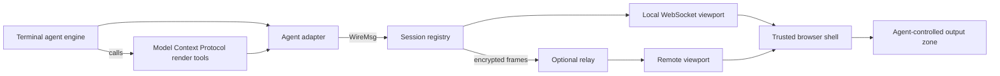

# Mirafold architecture

Mirafold is a local Node.js daemon plus a React browser client. It wraps
supported terminal coding agents without replacing their engines: each agent
runs through its own adapter, while the rest of Mirafold consumes one shared
message protocol.

This document is the ownership-level map of the shipped system. Source files
remain authoritative, and [ADAPTERS.md](ADAPTERS.md) is the normative contract
for adding or changing an agent integration.

## System model



Four rules define the shape:

1. **Each agent keeps its own engine.** Claude Agent, Codex, Gemini CLI, and
   OpenCode are independent adapters behind the same `AgentSession` interface.
2. **The wire protocol is the shared contract.** Adapters emit `WireMsg`; the
   session layer and browser do not consume provider-native events.
3. **A session is not a connection.** The daemon owns sessions, replay history,
   checkpoints, and agent lifecycle. A browser connection is a viewport that
   attaches to one session.
4. **The browser has a hard trust boundary.** Shell controls are application
   owned. Agent-authored content can render only in the output zone.

## Runtime structure

### Launcher and local daemon

[`bin/mirafold.js`](../bin/mirafold.js) runs the packaged daemon from the
current directory and opens the authenticated local URL once the server is
listening. [`server/index.ts`](../server/index.ts) is the daemon entry point:
it serves the built client, hosts the `/ws` WebSocket endpoint, binds to
`127.0.0.1`, applies the launch-token and Origin checks, creates the session
registry, and dials the hosted relay when a Pro entitlement is configured
(`MIRAFOLD_RELAY_URL=off` opts out; `server/relay/relay-url.ts` resolves that
plan, and a malformed value narrows to "off" rather than widening).

The daemon delegates by responsibility:

- [`server/adapters/`](../server/adapters/) drives agent engines and normalizes
  their output.
- [`server/sessions/`](../server/sessions/) owns session lifecycle,
  connections, and component actions. Its
  [`persistence/`](../server/sessions/persistence/) modules own checkpoints
  and replay; [`workspace/`](../server/sessions/workspace/) owns folder
  selection, filesystem requests, Git inspection, and uploads.
- [`server/security/`](../server/security/) owns local authentication,
  workspace-engine consent, and tool-permission policy.
- [`server/pty/`](../server/pty/) owns the interactive `!` pseudo-terminal
  (PTY) shell (`!` hands the finished transcript to the agent as its own
  turn; `!!` is shell-only — the agent never sees it).
- [`server/relay/`](../server/relay/) owns pairing, encryption, the daemon's
  outbound relay client, its transport contract, the license-key →
  entitlement-token exchange ([`entitlement.ts`](../server/relay/entitlement.ts):
  the permanent key stays on the daemon; a 48-hour signed token admits it to
  the relay), and the local-only subscription status/cancel surface
  ([`subscription.ts`](../server/relay/subscription.ts)).

The server is bundled to `dist-server/` for the published package. The browser
bundle is emitted to `dist/` and served by the same daemon outside development.

### Agent adapters

[`AgentSession`](../server/adapters/types.ts) is the provider-neutral seam. Its
core responsibilities are to accept prompts, emit normalized messages,
interrupt an in-flight turn, resolve supported permission requests, expose
model and durable conversation identity, refresh provider-owned prompt
options, and close cleanly. Some engines also publish backend classification
after startup because the truthful provider cannot be known before the engine
is running.

The shipped implementations are:

| Adapter | Engine surface |
| --- | --- |
| [`claude-code/claude-code.ts`](../server/adapters/claude-code/claude-code.ts) | Anthropic Agent SDK |
| [`codex/codex.ts`](../server/adapters/codex/codex.ts) | OpenAI Codex CLI app-server |
| [`gemini-cli/gemini-cli.ts`](../server/adapters/gemini-cli/gemini-cli.ts) | Gemini CLI headless stream |
| [`opencode/opencode.ts`](../server/adapters/opencode/opencode.ts) | Per-session `opencode serve` HTTP and event stream |
| [`mock/mock.ts`](../server/adapters/mock/mock.ts) | Scripted, model-free development and test backend |

[`server/adapters/index.ts`](../server/adapters/index.ts) detects available
backends, applies provider policy, validates a browser's backend choice, and is
the one place that constructs a concrete adapter. Shared code does not branch
on provider-specific events after this seam.

Gemini is the one shipped adapter with a project-settings write. Its headless
surface loads MCP servers from project settings, so the adapter needs a
Mirafold entry in `<workspace>/.gemini/settings.json`. Nothing is opened,
read, or written before the user grants workspace trust: only once the trust
ask has resolved to yes does the adapter create that file (when absent) or
merge the Mirafold MCP entry into the existing one, non-destructively and
through a no-follow open (`prepareSettings()` in
[`gemini-cli.ts`](../server/adapters/gemini-cli/gemini-cli.ts)).

See [ADAPTERS.md](ADAPTERS.md) for event grammar, capability differences,
credential constraints, MCP requirements, and the add-an-adapter checklist.

### Session registry and connections

[`SessionRegistry`](../server/sessions/registry.ts) owns active and dormant
sessions. Each entry contains the adapter, working directory, attached local
and remote viewports, the sequenced replay ring
([`replay-ring.ts`](../server/sessions/persistence/replay-ring.ts)), prompt catalog, and
the stream-derived activity state — status, turn counters, pending
permissions, usage — computed by the pure reducer in
[`session-state.ts`](../server/sessions/persistence/session-state.ts).

Checkpoints take two paths (Phase CPERF, 2026-09-17). Boundary checkpoints —
`user_prompt`, `turn_end`, `error`, permission frames, `bang_start`/`bang_end`,
plus activation, metadata, rename, detach, idle unload, and End Session —
are synchronous on purpose: a `turn_end` must not be observable before its
record is durable, and a failed rename or delete must roll back in place.
Interior stream frames share the 250 ms debounce, and that routine save
serializes on the loop but prepares its temp file with asynchronous I/O
(exclusive owner-only open, write, fsync, close) and commits with the
same synchronous rename — only if no synchronous save or delete for that
session ran meanwhile. Every `write()`/`delete()` invalidates the routine
save still preparing, the validity check and the rename share one
uninterrupted turn (an asynchronous rename after the check could still land
after a newer boundary save), and a superseded save is an expected
cancellation, not a success or a disk error. One routine save per session
is in flight at a time; requests during it only mark newer state dirty, and
a save that settles with dirty state schedules one further attempt through
the same timer, so continuous output still saves and the last message after
a boundary is never stranded. A failed routine save logs once and waits for
the next stream event or boundary — no retry loop.

Measured (2026-09-17, one machine, `checkpoint-load.bench.ts`: five mock
sessions with fixed histories, one delta each every 20 ms for 6 s, three
paired runs): with ~5 MB rings the run took 14.2–14.9 s and the loop stalled
up to 405–507 ms (p99 331–358 ms) before, versus 8.8–9.0 s and 149–172 ms
(p99 96–109 ms) after; with ~20 MB rings, 38.4–39.0 s and stalls of
1.5–1.7 s (p99 ~1.4 s) before, versus 12.2–13.7 s and 444–585 ms (p99
145–289 ms) after. Of the checkpoint time that used to occupy the loop
(~8 s at 5 MB, ~32 s at 20 MB), the write-and-fsync share (~75 %) left the
loop; what remains on it is `JSON.stringify` of the whole ring (~20 ms per
5 MB save, ~150 ms per 20 MB save), plus the rename. That serialization —
and the boundary saves — are the remaining synchronous cost; the 2026-08-25
sizing note (a 30 MB image-heavy ring costs ~156 ms to stringify) still
applies to it. Streamed deltas are coalesced twice before the
projection sees them: the registry merges same-lane deltas for
`DELTA_COALESCE_MS` (33 ms by default) before broadcasting, and the browser's
[`delta-queue.ts`](../web/src/transcript/delta-queue.ts) batches what arrives
per animation frame, so the projection copies its ledger once per frame, not
once per token.

[`connection.ts`](../server/sessions/connection.ts) is the transport-neutral
message boundary used by local WebSockets and relay viewports. It validates
client messages, attaches or creates a session, routes prompts and shell
actions, and sends per-viewport replies. Session broadcasts are sequenced and
fanned out to every attached viewport.

Fleet watchers do not attach to a session. Ordinary `watch_sessions`
connections receive metadata snapshots for `FleetView`; an additive
`transcript: true` option lets the in-session cockpit receive a bounded,
plain-text tail derived from each replay ring. Text movement wakes only those
opted-in watchers, and a remote watcher never receives a tail for a backend
that provider policy forbids over the paid relay.

[`session-store.ts`](../server/sessions/persistence/session-store.ts) writes bounded,
owner-only checkpoints and strictly validates them before recovery. A closed
tab detaches its viewport; it does not end the session. An idle active engine
can unload while the checkpoint remains available for lazy recovery.

### Browser client

[`web/src/main.tsx`](../web/src/main.tsx) has two routes:

- `/` mounts [`FleetView`](../web/src/components/FleetView.tsx), the
  mission-control view.
- `/s/<session-id>` mounts [`Shell`](../web/src/components/Shell.tsx), one
  session viewport.

[`session-bus.ts`](../web/src/transport/session-bus.ts) owns one
[`SocketClient`](../web/src/transport/ws.ts) and fans incoming messages to shell
consumers. `Shell` owns connection state, agent picker, the prompt, permission
and terminal-input bars, status, workspace panels, settings, notifications,
and other trusted controls. While its desktop Cockpit panel is open,
[`CockpitPanel.tsx`](../web/src/components/CockpitPanel.tsx) owns a second,
non-attached watcher socket for fleet snapshots and session-id-addressed acts.
The open preference lives in browser storage so direct session navigation
keeps the panel; an explicit close or replacement clears it.

[`OutputZone.tsx`](../web/src/components/OutputZone.tsx) receives the transcript
stream. Pure projection code converts wire messages into ordered transcript
rows, groups eligible rows into response documents, and keeps provider-native
tool activity, errors, and shell boundaries visible. The output zone delegates
structured content to [`web/src/registry/`](../web/src/registry/) and arbitrary
HTML to the sandboxed [`Artifact`](../web/src/components/Artifact.tsx) host.

#### The compact transcript (Phase TF, 2026-09-15)

The projection in
[`transcript-projection.ts`](../web/src/transcript/transcript-projection.ts)
is the one place wire chronology becomes rows, and the rules it applies are
deliberately narrow:

- **Every message, command, edit, failure, and in-flight call is its own
  row.** Prose is never folded into tool activity.
- **Only routine work groups.** A contiguous run of completed, error-free,
  exit-0 calls that the ENGINE classified as reads, listings, or searches
  (`tool_use.actions`, produced by
  [`routine-actions.ts`](../server/adapters/routine-actions.ts) from exact
  engine tool names or Codex's own `commandActions` — never inferred from
  shell text) collapses to one line such as "Read 8 files · 3 searches"
  ([`tool-visibility.ts`](../web/src/transcript/tool-visibility.ts)). Reasoning
  between two routine calls rides inside that group; leading or trailing
  reasoning is its own collapsed "Thinking" control.
- **Command rows carry outcomes.** `tool_result.exitCode` and `durationMs`
  are independent of `isError` (a nonzero exit that ran is not an error); a
  collapsed row previews the last non-empty lines.
- **Successful edits are inspectable by default.** An untouched compact edit
  shows at most 12 diff rows across 3 files, starting at changed text and
  limiting trailing context. Preparation shares the existing aggregate
  200,000-character/200-item guard with the change counts. Full input remains
  available in details; an explicit collapse also hides the preview and
  survives replay through the existing disclosure store. Writes show content
  without inventing old contents or added-line counts. Pending and failed calls label their
  expanded input without claiming completion.
- **Evidence is bounded and says so.** A large result keeps a UTF-8-safe head
  and tail within one 64,000-byte budget (`OUTPUT_CAP_BYTES` in
  [`server/adapters/types.ts`](../server/adapters/types.ts)); `omittedBytes`
  counts what fell between them. A running call streams
  `tool_output_snapshot` replacements (at most four per second per call,
  through [`live-output.ts`](../server/adapters/live-output.ts)); the ring
  keeps one snapshot per call and the result retires it.
- **Tasks are a lifecycle, not a call.** Subagents and background tasks ride
  the additive `task_update` message (engine-stated state, retained report,
  transient action); [`subagent-deck.ts`](../web/src/transcript/subagent-deck.ts)
  folds a task's own calls and prose under its anchor. A state the engine
  never stated is shown as inferred, never asserted.
- **Absence is declared, not implied.** `session_created.capabilities`
  ([`capabilities.ts`](../server/adapters/capabilities.ts)) says per adapter
  whether live output, thinking, tasks, and a task's child activity can
  appear, so the shell can say "unavailable for this agent" instead of
  letting silence read as "nothing happened". A replay past evicted history
  ends with `replay_complete { evicted: true }` and shows a notice; an
  outcome whose opening row was evicted becomes an explicit "(earlier call)"
  row.
- **Disclosure is the viewer's.** Expand/collapse choices are keyed by wire
  identity (`tool:<id>`, `think:seq:<n>`, `fold:<anchor>`, `deck:<id>`) and
  kept per session in `sessionStorage`
  ([`disclosure-store.ts`](../web/src/transcript/disclosure-store.ts)); the
  status bar's `show details` mode opens everything for that tab only.
  Nothing about disclosure reaches other viewers or the daemon.

Browser modules follow the same ownership boundaries:
[`transport/`](../web/src/transport/) owns daemon and relay connectivity;
[`transcript/`](../web/src/transcript/) owns transcript state and projection;
[`workspace/`](../web/src/workspace/) owns file, change-review, and folder-tree
state; [`input/`](../web/src/input/) owns prompt drafts, completions, and
navigation; and [`hooks/`](../web/src/hooks/) contains reusable React
lifecycle hooks.

### Keyboard ownership

Several shell parts listen for keys on `window` or `document`. Which one
wins is decided by the DOM's dispatch order — capture-phase listeners run
before bubble-phase ones, a `window` capture listener before a `document`
capture listener — and by whether the owner stops propagation. The table is
that order, top to bottom; a key an upper row claims never reaches a lower
one.

| Owner | Keys | Registered as | Active while | Claims the key? |
| --- | --- | --- | --- | --- |
| [`useFocusTrap`](../web/src/hooks/use-focus-trap.ts) | Tab, Shift+Tab | `document`, capture | a modal overlay, the enlarged file box, or a phone workspace dialog is open | yes — cycles focus inside the container |
| [`useEscapeKey`](../web/src/hooks/use-escape.ts) with `exclusive` — [`ModalCard`](../web/src/components/ModalCard.tsx), [`useWorkspacePanelFrame`](../web/src/hooks/use-workspace-panel-frame.ts) (phone Files/Changes dialog), the file-box enlarge in [`FolderTreePanel`](../web/src/components/folder-tree/FolderTreePanel.tsx) | Escape | `window`, capture + `stopPropagation` | that overlay is open | yes — dismisses / drills back / restores; nothing below sees it |
| Phone input-history card in [`InputNavigation`](../web/src/components/InputNavigation.tsx) | Escape | `window`, capture + `stopPropagation` | the ⋯ card is open | yes — closes it and restores focus to its toggle |
| [`PickerBlock`](../web/src/components/PickerBlock.tsx) | ArrowUp, ArrowDown, Enter, Escape | `document`, capture + `stopPropagation` | a live `/model`-style picker is showing | yes, unless a non-empty input, a picker row, or the phone card owns focus — only the idle (empty) prompt box cedes these keys |
| Prompt trigger in [`PromptBox`](../web/src/components/PromptBox.tsx) | `/`, `$` | `window`, capture + `stopPropagation` | a provider catalog offers that trigger and `globalTriggersDisabled` is off | yes, when typed outside an editable field or dialog — focuses the prompt box and inserts the trigger |
| Review shortcuts in [`useDiffPanelController`](../web/src/components/diff-panel/use-diff-panel-controller.ts) | `r`, `n` | `window`, bubble | the diff panel is open | only outside inputs and the prompt box (`REVIEW_SHORTCUT_EXCLUSION`), and only if nothing above called `preventDefault` |
| Busy interrupt in [`Shell`](../web/src/components/Shell.tsx) (`useEscapeKey`, non-exclusive) | Escape | `window`, bubble | a turn is running | the fallback: runs only when no exclusive owner above claimed the key |

[`Artifact`](../web/src/components/Artifact.tsx) also registers a
window-capture `keydown` listener, but it only records when a Tab was pressed
(to tell a user's gesture from a frame grabbing focus) and never claims the
key, so it has no row above.

Focused-element handlers sit outside this order because they see the key
first and only for their own element: the prompt box's textarea (completion
menu open: ArrowUp/ArrowDown move, Tab/Enter accept, Escape dismisses the
menu; otherwise ArrowUp on an empty desktop box enters input history, Enter
sends on desktop and inserts a newline on phone, Shift+Enter is always a
newline), the Cockpit quick-prompt input (Enter submits; Escape closes that
input without interrupting the active session), and the transcript's
input-history strips (ArrowUp/ArrowDown/Escape while one is selected).

Adding a global listener means choosing a row: an owner that must win uses
capture plus `stopPropagation` (the `exclusive` idiom); an owner that must
yield registers on bubble and checks `defaultPrevented` and the event target.
[`phone.e2e.ts`](../server/testing/e2e/phone.e2e.ts) and
[`input-navigation.e2e.ts`](../server/testing/e2e/input-navigation.e2e.ts) pin the
rows that have collided before.

### Generative UI

Mirafold exposes drawing tools to each agent through the Model Context Protocol
(MCP). Claude Agent uses the in-process server in
[`render-tools.ts`](../server/render-tools.ts); adapters that load an MCP
subprocess describe the launch through
[`adapters/render-mcp-cmd.ts`](../server/adapters/render-mcp-cmd.ts), which
starts the bundled [`render-mcp.ts`](../server/render-mcp.ts) over stdio.
Both paths use the schemas in
[`registry-spec.ts`](../server/registry-spec.ts).

A normal render call produces a `render` message containing a component name,
validated props, and an id. Calling again with the same id updates the existing
component in place. The browser validates the props again before mounting the
React component. Unknown components and malformed props degrade without
taking down the session.

When no registry component can express the result, an agent may emit an HTML
artifact. Artifacts are the only raw agent HTML path and run inside an
opaque-origin iframe whose CSP blocks every resource fetch (self-navigation is
contained by a liveness check, not prevented). Their actions cross a narrow,
nonce-validated bridge and re-enter the same server mediation used by registry
components.

## Core contracts

### Wire protocol

[`server/protocol.ts`](../server/protocol.ts) defines both directions of the
browser/server protocol:

- `WireMsg` covers streamed text and reasoning, tool activity (`tool_use`
  with its engine-classified `actions`, `tool_update`, `tool_output_delta`,
  `tool_output_snapshot`, `tool_result` with head/tail/exit/duration),
  task lifecycle (`task_update`), renders, artifacts, notices and pickers,
  usage, shell status, session metadata (`session_created` with its declared
  `capabilities`, `replay_complete` with `evicted`), entitlement and
  subscription reads, filesystem and folder-picker replies, PTY output,
  upload progress, fleet snapshots, and lifecycle events.
- `ClientMsg` covers prompts, interrupts, permission answers, session
  attachment and creation, mediated component actions, PTY input, filesystem
  requests (including `fs_listdir` continuation pages), the native folder
  picker, agent re-probing, subscription requests, uploads, browser error
  reports, keepalives, and fleet actions.

Fleet snapshots are per-viewport plumbing, not replay records: they have no
session sequence number. The optional transcript tail is requested by the
watcher and remains capped; it does not turn the fleet connection into a
second full transcript stream.

The protocol is **additive**: add a new message type or optional field; do not
reshape an existing message. Both ends ignore unknown message types, and
broadcast messages carry session-local sequence numbers so reconnecting
clients can request only the unseen tail. Replayed messages are marked so the
client can reproduce state without repeating live-only side effects.

### `AgentSession`

Every real adapter must preserve its provider's own behavior while satisfying
the normalized session contract. In particular:

- Prompts submitted during a turn are queued rather than lost or interleaved.
- Provider output retains useful native ordering and always has a discernible
  `turn_end` boundary.
- Interrupt leaves the session usable for another prompt.
- Durable provider conversation identity is exposed when the engine makes it
  available.
- Unsupported capabilities are omitted instead of simulated in shared code.
- Provider-native values that enter trusted shell chrome are visibly
  attributed when required.

The exact requirements live in [ADAPTERS.md](ADAPTERS.md); this overview does
not replace them.

## Trust boundaries

The trusted-shell boundary is the central security invariant:

```text
trusted shell: prompt · socket · permissions · PTY input · status · pins
------------------------- trust boundary -------------------------------
agent output: markdown · tool records · registry components · artifacts
```

- Provider credentials and configured endpoint URLs stay in the daemon. They
  are not serialized into browser messages.
- Agent output cannot render, wrap, or intercept the prompt, socket,
  permission controls, terminal input, status, or pin affordances.
- Markdown is rendered without raw HTML. Agent-authored HTML is confined to
  the sandboxed artifact iframe.
- Consequential agent tools follow provider permission policy and deny by
  default when an outstanding prompt times out or is interrupted.
- Component tool actions are allowlisted and validated on the server. A
  component cannot make an arbitrary client-side call.
- Local HTTP and WebSocket traffic is bound to loopback. With authentication
  enabled, both require the launch token; browser WebSockets also pass the
  Origin check.
- Remote viewports arrive through an outbound daemon connection. Session
  content is end-to-end encrypted; the relay still observes ordinary
  forwarding metadata such as connection timing and byte counts.
- The workspace browser is jailed to the selected working directory, but the
  agent and the `!` PTY are real local processes with the user's privileges.
  They are not sandboxes.

[SECURITY.md](../SECURITY.md) documents safe operation, disclosure, and the
accepted residual risks in detail.

## Key flows

### Launch and create a session

1. The launcher starts the daemon in the current directory and waits for its
   authenticated URL.
2. The browser connects and receives the available agents, backend choices,
   default directory, and daemon capabilities.
3. AgentPicker submits a validated agent, backend, and existing directory.
4. The registry creates an entry and `adapters/index.ts` constructs the chosen
   real adapter or the scripted mock.
5. The browser receives `session_created`, adopts `/s/<id>`, and attaches as a
   viewport.

### Run one turn

1. `PromptBox` sends a `prompt` through the session bus.
2. The connection broadcasts the corresponding `user_prompt` and passes the
   text to `AgentSession.pushPrompt()`.
3. The adapter drives its engine and normalizes native events into sequenced
   `WireMsg` records.
4. The registry buffers, checkpoints, and broadcasts the records to every
   viewport.
5. The browser projects the stream into transcript rows and response
   documents. A final `turn_end` settles activity and clears busy state while
   the provider conversation remains resumable.

### Render and act on a component

1. The agent calls a Mirafold MCP render tool with schema-checked props.
2. The adapter emits a `render` message at that exact point in the native
   event stream.
3. The client validates the props again and mounts or updates the component.
4. A component interaction becomes a typed `action` carrying its render id.
5. The server validates and mediates the action, then broadcasts any visible
   result back through the ordinary session stream.

### Reconnect or attach another viewport

1. The client attaches with the last sequence number it observed.
2. If that cursor remains in the bounded buffer, the registry replays only the
   unseen tail (`session_created.resumed`); otherwise it sends the complete
   available replay. Either way the replay is bracketed: the client publishes
   history once when `replay_complete` arrives, and `evicted: true` on that
   message means the ring had already dropped older history, which the
   transcript states rather than hides.
3. A second local tab follows the same path. A paired remote browser uses the
   same connection logic after the relay layer authenticates and decrypts its
   frames.

### Switch sessions from the in-session cockpit

1. Opening Cockpit creates a fleet watcher with bounded transcript tails
   enabled; it does not attach another viewport to any session.
2. A row can reveal its current text tail or dispatch the existing
   session-id-addressed prompt, interrupt, and end actions.
3. Following the row's session link performs ordinary `/s/<id>` navigation.
   Browser storage restores Cockpit in the destination session; only an
   explicit close or replacement removes that preference.

## Repository map

| Path | Responsibility |
| --- | --- |
| `bin/` | Installed launcher and trusted browser opener |
| `server/index.ts` | Daemon entry point, HTTP/WebSocket server, relay startup |
| `server/protocol.ts` | Shared browser/server protocol |
| `server/adapters/` | Agent integrations and the `AgentSession` seam |
| `server/sessions/` | Session, connection, persistence, workspace, Git, upload, and action logic |
| `server/security/` | Authentication, tool permissions, and executable trust |
| `server/pty/` | Interactive `!` shell |
| `server/relay/` | Pairing, encryption, outbound remote transport, and the entitlement/subscription exchange |
| `server/testing/` | Integration, browser, visual, and live-test infrastructure |
| `web/src/components/` | Trusted shell and session/fleet surfaces |
| `web/src/registry/` | Agent-paintable React component vocabulary |
| `web/src/styles/` | Structural styles by surface |
| `web/src/themes/` | Theme palettes and token manifest |
| `docs/` | Architecture, adapters, local models, release process, and feature specifications |

Tests live beside their source. Suffixes select the tier: `*.test.ts` for
in-process unit tests (they may touch the OS — temp dirs, a real `git`, a
loopback listener — but never a daemon), `*.itest.ts` for out-of-process
integration (a real daemon, MCP child, or filesystem watcher), `*.e2e.ts` for
tests that need the built bundle (mostly headless-browser end to end),
`*.uitest.ts` for managed-browser and visual checks, and `*.ltest.ts` for
opt-in live-agent tests.

## Standing constraints

- TypeScript spans the server and browser in one Yarn package.
- Shared server/browser modules require matching aliases in both
  `tsconfig.json` and `vite.config.ts`.
- Shared code stays agent-neutral; provider-specific behavior belongs in its
  adapter.
- The wire protocol only grows additively.
- The trusted-shell boundary is not relaxed for convenience.
- UI work is exercised against the mock before a live model is involved.
- The visual language is a terminal workbench, not a chat application:
  monospace command input, rich output, no message bubbles, and
  provider-native activity kept visible: routine engine-classified work
  groups as it completes, reasoning collapses when the answer begins, and
  every message, command, edit, and failure stays its own row.
- Adapter drive loops stay local. How an engine is pumped, aborted, and
  resumed differs per engine and is deliberately not shared; the
  wire-contract obligations that must behave identically everywhere (the
  permission ledger, the checklist painting, the first-turn guidance, the
  slash-turn envelope, output caps, live-output snapshots, routine-work
  classification, declared capabilities) live once in `server/adapters/`
  shared modules (`wire-helpers.ts`, `types.ts`, `live-output.ts`,
  `routine-actions.ts`, `capabilities.ts`) and every adapter composes them.
  The distinct render/artifact update paths and the scripted mock are not
  genericized only to reduce line count.

Current work belongs in [PLAN.md](../PLAN.md), completed history in
[PLAN-ARCHIVE.md](../PLAN-ARCHIVE.md), and decided product terms in
[GLOSSARY.md](../GLOSSARY.md). Do not duplicate roadmap status here.
